---
title: "Núcleo hidrorretentor orgânico como substrato para bioengenharia dos solos"
lang: pt-BR
toc: false
toc-depth: 2
number-sections: true
link-citations: true
reference-section-title: "Referências"
keywords: "Geocomposto biodegradável; Typha domingensis; Retenção hídrica; Fitotoxicidade; *Eruca sativa*"
bibliography: referencias.bib
---

Luiz Diego Vidal Santos (b)*

Francisco Sandro Rodrigues Holanda (a)

Eliana Midori Sussuchi (c)

(a) Agronomy Engineering Department, Federal University of Sergipe (UFS), São Cristóvão, Sergipe, Brazil

(b) Graduate Program in Intellectual Property Science, Federal University of Sergipe (UFS), São Cristóvão, Sergipe, Brazil

(c) Chemical Engineering Department, Federal University of Sergipe (UFS), São Cristóvão, Sergipe, Brazil

* Corresponding author: Luiz Diego Vidal Santos. Email: <vidal.center@academico.ufs.br>. ORCID: <https://orcid.org/0000-0001-8659-8557>

# Resumo {.unnumbered}

Geocompostos hidrorretentores biodegradáveis, quando associados a geossintéticos de reforço (como geogrelhas), constituem uma alternativa de Soluções Baseadas na Natureza (SbN) para a bioengenharia de solos, desde que o desempenho hidrofísico do núcleo não introduza risco de alelopatia e de supressão da fase inicial de estabelecimento. A aplicação de biomassa lignocelulósica em núcleos hidrorretentores ainda carece de validação conjunta que conecte retenção hídrica, estabilidade de matriz e bioatividade, permitindo separar modulação morfogênica de fitotoxicidade aguda. Esta pesquisa avaliou quatro formulações de núcleo à base de fibras e resíduos de *Typha domingensis* Pers. como substrato para cultivo de rúcula (*Eruca sativa* Mill.), comparando $N_1$ (limbo, fibras, resina e solvente), $N_2$ (sem resina), $N_3$ (resíduos vegetais com resina) e $N_4$ (resíduos e fibras sem solvente) contra controle. A formulação completa $N_1$ superou o controle em todos os indicadores morfogênicos, com germinação 5,8% superior, elongação do hipocótilo 106,6% maior, acúmulo de biomassa fresca 158,5% superior e extensão radicular 89,7% mais pronunciada, sem evidência de fitotoxicidade ou colapso de vigor. A cinética germinativa apresentou Índice de Velocidade de Germinação 12,5% superior ao controle em $N_1$, enquanto o Tempo Médio de Germinação foi 5,8% maior, refletindo embebição modulada pela matriz hidrorretentora, sem comprometimento da viabilidade final. A formulação exibiu perfil químico favorável ao estabelecimento vegetal, com pH próximo à neutralidade e disponibilidade elevada de Potássio e Fósforo Total, além de estabilidade térmica do reforço fibroso validada até 220 °C, confirmando aplicabilidade em geocompostos para revegetação sob regime de suplementação hídrica controlada.

## Palavras-chave {.unnumbered}

Geocomposto biodegradável; *Typha domingensis*; retenção hídrica; fitotoxicidade; *Eruca sativa*.

# Introdução

Na engenharia geoambiental, o desenvolvimento de compósitos orgânicos de base biológica responde a uma restrição de projeto em que desempenho funcional, descarte e persistência ambiental precisam ser tratados como variáveis acopladas ao longo do ciclo de vida [@prambauer2019_biodegradable]. Em aplicações de revegetação, resíduos vegetais podem ser convertidos em matrizes de suporte com função de retenção hídrica e reforço mecânico, reduzindo a dependência de insumos altamente solúveis e deslocando o controle do estabelecimento inicial para mecanismos hidrofísicos e de interface planta substrato [@silva2017_reaproveitamento]. Nesse regime, a matriz lignocelulósica atua como reservatório poroso que armazena água e a libera sob gradiente de potencial hídrico, amortecendo pulsos de irrigação e reduzindo a variabilidade microambiental que governa germinação e emergência [@liu2020_borax].

O desempenho de geocompostos hidrorretentores resulta do acoplamento entre filtração, retenção de água e estabilidade mecânica, com controle simultâneo de fluxo e suporte estrutural quando a disponibilidade hídrica é intermitente [@koerner2012_designing; @cislaghi2020_biodegradable]. Sistemas com frações sintéticas podem atingir metas de desempenho, porém a persistência ambiental e o descarte passam a integrar o problema de engenharia, o que justifica a substituição por biopolímeros e reforços vegetais que preservem integridade operacional na janela crítica de estabelecimento e, em seguida, degradem de forma compatível com o meio [@daria2020_characteristics; @Giupponi2019HowProposals]. Em paralelo, a biota associada ao sistema reconfigura propriedades físicas e químicas do microambiente, de modo que a resposta final emerge do acoplamento material, microbiota e substrato, com implicações para uniformidade de crescimento e supressão biológica sob flutuação climática [@abis2020_reduced; @haiming2020_microbial].

Fibras de *Typha domingensis* Pers. apresentam aderência tecnológica ao problema por oferecerem frações lignocelulósicas com potencial de manufatura de geotêxteis, permitindo escalabilidade e controle de processo [@ghosh2009_suitability]. A espécie é uma macrófita emergente associada a ambientes úmidos e alagáveis, nos quais oscilações de oxigenação e saturação são recorrentes, e sua anatomia com aerênquima sustenta difusão interna de gases sob hipóxia, característica que indica resiliência funcional em interfaces solo água [@kamali2022_typha; @cunhacruzy2020_rootanatomy]. No domínio de materiais, a elevada fração de celulose e lignina contribui para rigidez e resistência à tração, favorecendo a manutenção de uma arquitetura porosa estável quando incorporada a compósitos, enquanto sua tolerância a estresses e emprego em fitorremediação ampliam a aplicabilidade em cenários de alta variabilidade ambiental [@sujatha2022_cellulose; @deguenon2022_influence; @hegazy2011_phytoremediation].

O uso de biomassa lignocelulósica em núcleos hidrorretentores, entretanto, exige validação simultânea de desempenho hidrofísico e segurança química, pois metabólitos secundários podem ser lixiviados e modular o microambiente de germinação por rotas do acetato e do chiquimato, alterando crescimento inicial sem necessariamente afetar viabilidade [@cheng2015_research; @inderjit1996_phenolics]. Como *Typha domingensis* sintetiza frações fenólicas e terpênicas, a formulação precisa dissociar retenção de água e estabilidade de matriz do risco de inibição por aleloquímicos, assegurando que a funcionalidade hidráulica não introduza supressão do estabelecimento [@muzell2016_allelopathy]. Apesar de avanços recentes em geocompostos naturais para retenção hídrica [@akter2020_development; @santos2024_geogrid], permanece uma lacuna metodológica quando se exige um protocolo único que conecte propriedades do material, sorção, química do extrato e resposta biológica em germinação e morfogênese.

Este trabalho avaliou quatro formulações de núcleos hidrorretentores à base de *Typha domingensis* como substrato para cultivo de rúcula (*Eruca sativa*), quantificando integridade química e estabilidade térmica do reforço, caracterização química das formulações, sorção macroscópica e resposta biológica por germinação, cinética germinativa e morfometria inicial, além de desempenho em microcosmo em bandeja. O objetivo foi testar se a formulação completa opera como condicionador hidrofísico do microambiente sem evidência de fitotoxicidade aguda, com inferência estatística capaz de separar ganhos morfogênicos e variabilidade experimental.

# Material e métodos

## Localização e condições experimentais

O experimento foi conduzido em uma casa de vegetação do Departamento de Engenharia Agronômica da Universidade Federal de Sergipe (UFS), estado de Sergipe, Brasil. As coordenadas geográficas aproximadas do local são 10°55'29.2" S, 37°06'55.9" W, situado a uma altitude média de 50 metros acima do nível do mar. A região se enquadra em clima do tipo Aw conforme classificação de Köppen-Geiger [@alvares2013_koppen; @koppen1936_klimate].

## Características das sementes de rúcula

As sementes de rúcula (*Eruca sativa* Mill.) utilizadas foram da cultivar Folha Larga, conforme registro no Registro Nacional de Cultivares do MAPA nº 0448 [@mapa2012_rnc_rucula]. Apresentavam pureza física de 98%, germinação padrão de 85%, umidade máxima de 10%, e comportamento germinativo típico com emergência entre 3 a 5 dias em condições ótimas [@vieira2011_qualidade].

Essa cultivar é reportada como responsiva a condições de manejo e disponibilidade hídrica em estágio inicial, o que justifica seu uso como espécie indicadora em triagens de bioatividade [@dijkstra2017_cultivo].

## Confecção dos geocompostos hidrorretentores

Folhas de taboa (*Typha domingensis*) foram colhidas mantendo o rizoma no solo. O limbo e a bainha foliar foram separados, cortados em guilhotina e as fibras lavadas em água corrente e secas ao ar por 72 h, com o fluxo operacional sintetizado na Figura 1. O limbo foi moído em moinho de martelos para gerar resíduo vegetal fino. Em materiais lignocelulósicos, parâmetros dimensionais e resistência mecânica exibem variabilidade relevante em função de espécie, fração anatômica e processamento, o que afeta molhabilidade, sorção e integridade estrutural em compósitos [@cesar2015_cellulose; @betene2020_physicochemical].

As fibras e resíduos receberam tratamento químico com resina vegetal de óleo de mamona, solvente D-limoneno e espessantes naturais (Amida 90% e extrato de *Aloe vera*), considerando que agentes hidrocoloides e extratos vegetais podem alterar o regime de retenção hídrica e a disponibilidade de solutos no microambiente do propágulo vegetal em ensaios de triagem [@luligo2024_aloevera; @priolo2024_duckweed].

A resina bicomponente foi formulada em proporção 2:1 (pré-polímero, isocianato e poliol), permitindo reação de poliadição controlada em matriz de poliuretano de base renovável [@cardoso2013_resinasmamona; @botvinova2020_bicomponent]. Após homogeneização em encoladeira por cinco minutos até distribuição uniforme das frações líquidas, o material foi prensado a 1 tonelada por 24 h em molde metálico, conforme representado na Figura 1. Os núcleos absorventes têm espessura de 50 mm com densidade de 0,625 g/cm³ e o geocomposto hidrorretensor completo 100 mm com densidade de 1,432 g/cm³.

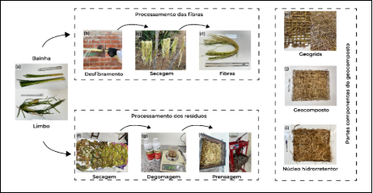{#fig:fibras width="100%"}

Foram produzidas quatro formulações. A formulação $N_1$ (formulação completa) foi composta por 24% de limbo, 20% de fibras, 20% de resina, 6% de solvente e 30% de espessante. A formulação $N_2$ (sem resina) foi composta por 44% de limbo, 20% de água destilada, 6% de solvente e 30% de espessante, sem resina. A formulação $N_3$ (resíduos vegetais) foi composta por 44% de limbo, 20% de resina, 6% de solvente e 30% de espessante. A formulação $N_4$ (resíduos e fibras) foi composta por 24% de limbo, 20% de fibras, 26% de resina e 30% de espessante, sem solvente. A homogeneização foi feita em encoladeira por cinco minutos até distribuição uniforme das frações líquidas.

## Caracterização das Fibras

A caracterização química e morfológica das fibras de *Typha domingensis* foi realizada para verificar a integridade estrutural e a funcionalidade química do substrato fibroso após o processamento mecânico a partir de espectroscopia de infravermelho com transformada de Fourier (FTIR). As análises foram realizadas em um espectrômetro PerkinElmer Spectrum Two, operando na faixa espectral de 4000 a 400 cm⁻¹ com resolução de 4 cm⁻¹ e 32 varreduras por amostra, utilizando pastilhas de KBr prensadas contendo 2 mg de fibra moída e seca a 60 °C.

A estabilidade térmica do reforço fibroso, parâmetro determinante para o processamento de cura da resina, foi avaliada por termogravimetria (TGA) utilizando um analisador Shimadzu TGA-50. As amostras (aproximadamente 5 mg) foram aquecidas de 25 a 600 °C a uma taxa de 10 °C min⁻¹, sob atmosfera inerte de nitrogênio (fluxo de 100 mL min⁻¹).

## Caracterização Química das Formulações

O perfil nutricional e químico dos núcleos hidrorretentores ($N_1$-$N_4$) foi determinado para validar o potencial de aporte de macronutrientes e a reação do meio (pH). As análises foram conduzidas pelo Instituto Tecnológico e de Pesquisas do Estado de Sergipe (ITPS), adotando protocolos oficiais do Ministério da Agricultura, Pecuária e Abastecimento (MAPA) para ensaios em fertilizantes e corretivos, conforme a Instrução Normativa SDA nº 3 de 2015 [@brasil_mapa_sda_in03_2015_metodos_oficiais].

Foram quantificados os teores de Nitrogênio Total, Fósforo (solúvel em CNA + água e Total), Potássio (K⁺), Cálcio (Ca²⁺) e Magnésio (Mg²⁺), além do pH em suspensão aquosa. Esta caracterização visa dissociar o efeito físico de retenção hídrica do potencial efeito químico de fertilização de base conferido pela decomposição da matriz orgânica.

## Avaliação da fitotoxicidade

### Preparação dos extratos e montagem

Os extratos ($N_1$-$N_4$) e o controle (água destilada) foram preparados em proporção 1:10 (20 g para 180 mL de água destilada). O material foi submetido a agitação mecânica por 5 minutos em agitador orbital, seguido de repouso de 15 minutos em temperatura ambiente e filtração em papel filtro qualitativo para remoção de partículas sólidas. O pH de cada extrato foi determinado conforme método Embrapa [@embrapa2009_ph] utilizando potenciômetro digital calibrado.

As sementes de rúcula foram submetidas a processo de assepsia rigorosa para eliminar contaminações fúngicas, com imersão em álcool etílico 70% por 1 minuto, seguida de imersão em solução de hipoclorito de sódio 0,2% por 1 minuto e três lavagens sucessivas em água destilada autoclavada de 1 minuto cada, utilizando pinça flambada para transferência entre soluções. Após a assepsia, as sementes foram dispostas em caixas Gerbox (acrílico transparente 11 × 11 × 3,5 cm) contendo papel filtro tipo qualitativo previamente autoclavado, umedecido com os extratos preparados na proporção de 2,5 vezes o peso seco do substrato. Cada tratamento utilizou 100 sementes distribuídas em cinco caixas Gerbox (20 sementes por caixa). As caixas foram mantidas em incubadora (câmara de crescimento) BOD a temperatura controlada de 20 °C, sob fotoperíodo de 8/16 h (luz/escuro) por período total de 10 dias.

### Efeito dos extratos sobre a germinação

A cinética germinativa foi parametrizada pelo Índice de Velocidade de Germinação (IVG), calculado pelo somatório da razão entre germinação diária e tempo (Eq. 1), conforme metodologia de Maguire [@maguire1962_speed]:

$$ IVG = \sum_{i=1}^{n} \frac{G_i}{N_i} \label{eq:ivg} $$

Simultaneamente, a uniformidade do processo foi aferida pelo Tempo Médio de Germinação (TMG), definido pela média ponderada dos eventos germinativos (Eq. 2), segundo Labouriau [@labouriau1983_germinacao]:

$$ TMG = \frac{\sum G_i T_i}{\sum G_i} \label{eq:tmg} $$

A magnitude da interferência fitotóxica ou bioestimulante foi determinada pela variação percentual dos parâmetros biológicos em relação ao controle (Eq. 3), onde $X_T$ e $X_C$ representam os valores médios das variáveis resposta no tratamento e no controle, respectivamente:

$$ \text{Inibição (\%)} = \frac{X_T - X_C}{X_C} \times 100 \label{eq:inibicao} $$

Para paralisar o metabolismo e preservar a arquitetura tecidual visando a análise morfométrica digital, as plântulas foram submetidas ao congelamento (-10 °C; 24 h) imediatamente após o período experimental de 10 dias, sendo posteriormente mensuradas (raiz e parte aérea) via processamento de imagem no software ImageJ.

{#fig:morfologia width="100%"}

### Avaliação do crescimento e da produção conduzidos em solo

#### Primeiro bioensaio (bandejas)

A configuração experimental em mesocosmo adotou o Delineamento Inteiramente Casualizado (DIC), totalizando 20 repetições por tratamento ($N_1$-$N_4$ e controle). A matriz edáfica de suporte foi reconstituída através de uma mistura ternária equiproporcional (1:1:1 v/v) de Neossolo Quartzarênico, substrato orgânico comercial e húmus, com massa padronizada de 50 g por unidade experimental inoculada com o núcleo. O protocolo de estabelecimento da cultura envolveu semeadura em duplicata com raleio de ajuste populacional para um indivíduo remanescente no 8º dia após a emergência (DAE), mantendo-se regime de irrigação diária e suplementação nutricional via núcleo a cada 15 dias (início: 15º DAE). A fase de crescimento estendeu-se por 44 dias, após os quais um subgrupo (n=5) foi direcionado ao bioensaio subsequente.

A modelagem do crescimento vegetal baseou-se em índices adimensionais de performance relativa. A eficiência de elongação dos tecidos radiculares (Eq. 4) e da parte aérea (Eq. 5) foi determinada pela razão normalizada entre as médias biométricas dos tratamentos ($R_T, A_T$) e do controle ($R_C, A_C$):

$$ R \% = \frac{R_T}{R_C} \times 100 \label{eq:r} $$

$$ CPA \% = \frac{A_T}{A_C} \times 100 \label{eq:cp} $$

O vigor global do lote ($IVP\%$) integrou a capacidade germinativa ($G\%$) e o crescimento total da plântula ($CTP$) em um indicador único de robustez fisiológica (Eq. 6). Estruturalmente, a compacidade do sistema radicular foi aferida pela Densidade Radicular ($DensRad$), expressando a alocação de biomassa por unidade de volume ocupado (Eq. 7):

$$ IVP \% = \frac{G \% \times CTP}{100} \label{eq:ivp} $$

$$ \text{DensRad} = \frac{\text{massa radicular (g)}}{\text{volume radicular (cm}^3)} \label{eq:densrad} $$

Finalmente, a contribuição relativa do bioinsumo para o acúmulo de biomassa foi quantificada pelo índice de Dependência do Núcleo ($DN\%$), comparando-se a produção de matéria seca no sistema condicionado ($MS_{CS}$) versus o sistema não-suplementado ($MS_{SS}$) (Eq. 8):

$$ DN \% = \frac{MS_{CS} - MS_{SS}}{MS_{CS}} \times 100 \label{eq:dn} $$

#### Análise estatística

A arquitetura analítica foi fundamentada no Delineamento Inteiramente Casualizado (DIC), precedida pela validação rigorosa das premissas de normalidade residual (Shapiro-Wilk) e homoscedasticidade de variâncias (Levene). Visando mitigar a instabilidade inerente a conjuntos de dados biológicos finitos e garantir a robustez dos estimadores fora da normalidade assintótica ideal, implementou-se a técnica de reamostragem por *bootstrapping* com 1.000 iterações. Este procedimento gerou Intervalos de Confiança de 95% com correção de viés e aceleração (BCa), oferecendo uma inferência mais segura sobre a média populacional.

A segregação de médias *post-hoc* utilizou o teste de Tukey HSD (p \< 0,05) como controle do erro em comparações múltiplas, o que permite interpretar diferenças entre pares de tratamentos sem inflar a taxa de falso positivo em matrizes com múltiplas respostas [@hsu1996_multiplecomparisons]. Em paralelo, pontos extremos foram diagnosticados por grupo de tratamento por meio do critério 1,5 vezes o intervalo interquartil, removendo-se apenas observações que distorciam a dispersão empírica sem representar o regime central do processo, procedimento aplicado às respostas morfométricas e cinéticas antes da estimação de médias e do ajuste de modelos. Além da significância estatística, a magnitude do fenômeno biológico foi dimensionada pelas métricas de tamanho de efeito (*d* de Cohen e $\eta^2$ parcial), permitindo a interpretação da relevância prática das intervenções.

As métricas de sorção ($\Delta m$ e $\Delta m_{rel}$) foram avaliadas por Modelos Lineares Generalizados com distribuição Gamma e função de ligação log, estratégia adequada para respostas estritamente positivas e assimétricas. O ganho absoluto em massa hídrica foi operacionalizado como diferença pareada por disco, com $\Delta m = m_{\text{úmida}} - m_{\text{seca}}$, preservando a estrutura intrínseca do ensaio e reduzindo a dependência associada ao emparelhamento úmido seco. Valores negativos atribuídos à drenagem gravitacional e à variabilidade de pesagem foram rastreados, suprimidos do ajuste inferencial e mantidos em registro para rastreabilidade do processo. A inferência foi implementada em Python 3.13 por meio da biblioteca Statsmodels, e as diferenças entre formulações foram avaliadas por testes de Wald em comparações múltiplas com ajuste de Holm, sendo a segregação visual em letras incorporada diretamente às figuras quando pertinente.

Para integrar explicitamente a dimensão temporal da germinação, os dados foram analisados como tempo-até-evento, utilizando curvas de Kaplan-Meier (germinação acumulada) e modelo de riscos proporcionais de Cox. Os registros originais estavam estruturados como contagens cumulativas por tempo em caixas Gerbox (20 sementes por repetição); para permitir a modelagem, as contagens foram expandidas para observações ao nível de semente, preservando o total por caixa e considerando censura no 10º dia para sementes não germinadas. O ajuste de Cox utilizou erros-padrão robustos com cluster por caixa (repetição), e os coeficientes foram interpretados como razões de risco (hazard ratio; HR) em relação ao controle (água destilada).

Adicionalmente, para sintetizar a resposta multivariada do microcosmo (comprimentos, massas e índice de dependência), foi aplicada Análise de Componentes Principais (PCA) após padronização (*z-score*), permitindo visualizar padrões de co-variação e separação multivariada entre formulações.

# Resultados e discussão

## Caracterização Tecnológica do Reforço Fibroso

A integridade química das fibras de *Typha domingensis* após a cominuição mecânica foi corroborada pelo perfil espectroscópico de infravermelho (FTIR), apresentado na Figura 3. O espectro exibe uma banda larga e intensa centrada em 3340 cm⁻¹, atribuída ao estiramento das ligações O-H dos grupos hidroxila presentes na celulose, hemicelulose e lignina. A proeminência desta banda é relevante para a aplicação proposta, pois confirma a alta disponibilidade de sítios hidrofílicos superficiais, mecanismo fundamental para a retenção hídrica e para a formação de ligações de hidrogênio na interface fibra-matriz [@Sayam2022].

Os picos observados em 2918 e 2850 cm⁻¹ correspondem, respectivamente, ao estiramento assimétrico e simétrico de ligações C-H em cadeias alifáticas (grupos metila e metileno), constituintes estruturais dos polissacarídeos [@Widiarto2019]. A presença de um pico bem definido em 1735 cm⁻¹, característico do estiramento carbonílico (C=O) de grupos acetila (componentes das hemiceluloses) e ésteres de ácido ferúlico ou p-cumárico (lignina), indica que o processamento não induziu degradação oxidativa severa ou remoção substancial dessas frações amorfas [@BenitezGuerrero2014]. Adicionalmente, as vibrações do esqueleto aromático da lignina foram identificadas em 1605 e 1510 cm⁻¹, juntamente com a banda em 1240 cm⁻¹ (estiramento C-O do anel arílico), confirmando a natureza lignocelulósica do reforço e sua estabilidade química intrínseca [@Sayam2022].

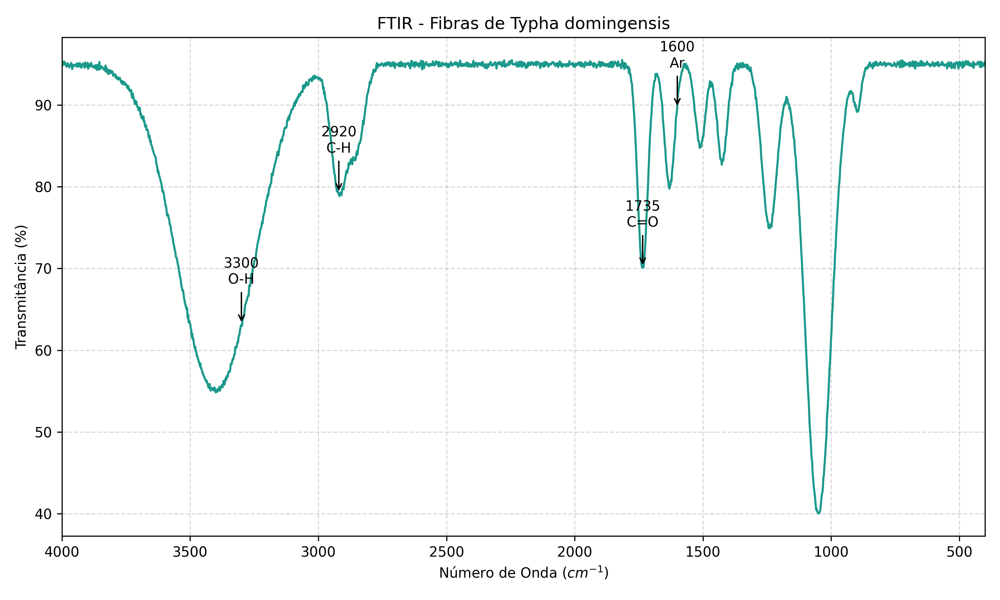{#fig:ftir width="100%"}

O comportamento térmico do reforço, determinante para a janela de processamento do compósito, é detalhado na curva termogravimétrica (TGA) da Figura 4. O evento inicial de perda de massa (\~6%) ocorre abaixo de 100 °C, atribuído à eliminação de água fisicamente adsorvida e voláteis de baixo peso molecular, reiterando o caráter higroscópico do material mapeado no FTIR [@BenitezGuerrero2014].

A degradação térmica estrutural inicia-se efetivamente em torno de 220 °C (*Tonset*), com um "ombro" característico estendendo-se até 300 °C, associado à despolimerização térmica das hemiceluloses, que possuem menor estabilidade devido à sua estrutura amorfa e ramificada [@Widiarto2019]. O evento principal de degradação ocorre na faixa de 310 a 380 °C, onde a curva apresenta sua máxima inclinação (derivada máxima), correspondendo à ruptura das cadeias glicosídicas da celulose cristalina (α-celulose) [@Sayam2022]. A estabilidade térmica até \~220 °C valida a utilização destas fibras no processo de cura da resina poliuretana vegetal, que ocorre em temperaturas significativamente inferiores, garantindo que o reforço atue sem degradação térmica prematura. O resíduo sólido a 600 °C (superior a 20%) reflete o conteúdo inorgânico (sílica ou fitólitos) e a estrutura carbonosa da lignina condensada, que contribui para a inércia química do produto final.

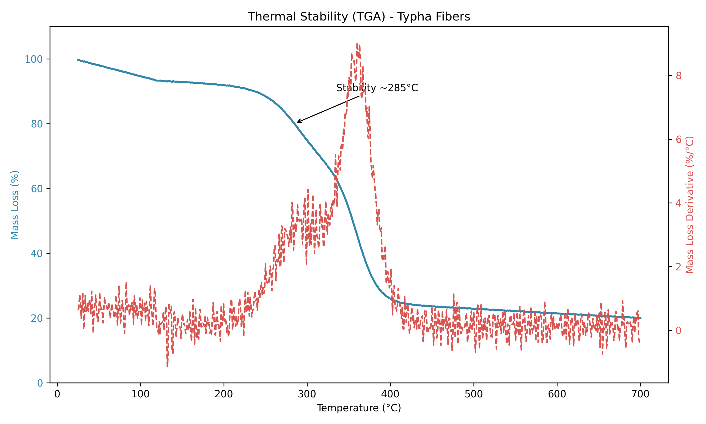{#fig:tga width="100%"}

## Caracterização Química dos Núcleos Hidrorretentores

A análise da composição elementar e do pH dos núcleos (Tabela 1) demonstrou que a incorporação da matriz polimérica à base de mamona ($N_1$) alterou significativamente o perfil químico do substrato. O compósito $N_1$ apresentou pH próximo à neutralidade (6,38), enquanto as formulações sem a resina completa ($N_2$, $N_3$) exibiram caráter ácido (pH < 4,5), típico de resíduos lignocelulósicos não tamponados.

Em termos nutricionais, $N_1$ destacou-se pela elevada concentração de Potássio (1004,98 mg L⁻¹) e Fósforo Total (62,01 mg L⁻¹), valores superiores aos observados nas frações puramente fibrosas ($N_4$ com K = 740,74 mg L⁻¹ e P = 9,85 mg L⁻¹). Como a matriz de base do sistema é o núcleo lignocelulósico de fibras de taboa, a resina à base de óleo de mamona deve ser interpretada apenas como componente de formulação do $N_1$, e o acoplamento entre fibra e fase resinosa pode modificar a liberação de solutos no extrato. O Nitrogênio Total foi reportado como inferior ao limite de quantificação do método (LQ = 0,16%) em todas as amostras, o que caracteriza um dado censurado e não uma concentração quantificada.

Em populações naturais de *Typha domingensis*, concentrações foliares de N na ordem de 30,54±2,01 a 33,04±2,15 mg g⁻¹ de massa seca (aproximadamente 3,05 a 3,30% em base seca) são reportadas, reforçando que o resultado aqui obtido descreve a fração de N acessível ao protocolo analítico aplicado à matriz processada e não a assinatura nutricional típica de tecido foliar íntegro [@esteves2013_resorption]. Nessas condições, a resposta biológica observada nas plântulas não pode ser atribuída a fertilização nitrogenada direta, permanecendo mais consistente com a melhoria de propriedades físicas do microambiente e com efeitos bioestimulantes associados a frações orgânicas solúveis liberadas pela matriz. Os teores de Cálcio e Magnésio em N1 (577,5 e 292,6 mg L⁻¹, respectivamente) também sugerem um balanço catiônico favorável ao desenvolvimento radicular.

Esta configuração química de $N_1$ (pH neutro e alta disponibilidade de P e K) converge com as exigências ecofisiológicas da *Eruca sativa*, que apresenta desenvolvimento ótimo em pH 6,0-7,0, onde a disponibilidade de macronutrientes é maximizada e a fitotoxicidade por Al³⁺ é neutralizada [@filgueira2008_novo].

A acidez observada em $N_2$ e $N_3$ (pH ~4,4) é crítica, pois em matrizes de solo, valores abaixo de 5,0 podem induzir restrições de P, Ca e Mg, além de potencializar a solubilidade de metais tóxicos [@taiz2017_physiology]. No contexto de bioengenharia, a neutralização proporcionada pelo compósito $N_1$ indica que a formulação atua como um corretivo de acidez local, criando micro-hotspots favoráveis à colonização radicular em solos degradados ou ácidos.

Adicionalmente, o reporte de Nitrogênio Total abaixo do LQ desacopla o efeito bioestimulante observado (ganho de hipocótilo) de uma resposta trófica clássica "dose-dependente". O vigor vegetativo em $N_1$ parece ser sustentado pelo balanço de K⁺ na osmorregulação, essencial para manter a turgescência celular sob flutuações hídricas, e pela oferta de P para o metabolismo energético da germinação. A detecção de altos níveis de Potássio está alinhada à capacidade da *Typha* em bioacumular nutrientes, sugerindo que o núcleo funcione como um reservatório de fertilidade que recicla elementos extraídos da própria biomassa utilizada na manufatura.

Tabela 1. Caracterização química e nutricional dos núcleos hidrorretentores (N1-N4), indicando pH e concentração de macronutrientes. {#tbl:quimica}

| Parâmetro | Unidade | $N_1$ (formulação completa) | $N_2$ (sem resina) | $N_3$ (resíduos vegetais) | $N_4$ (resíduos e fibras) |
|:-----------|:----------:|:----------:|:----------:|:----------:|:----------:|
| Nitrogênio Total | \% | \<0,16 | \<0,16 | \<0,16 | \<0,16 |
| Fósforo (CNA + água) | mg L⁻¹ | 61,27 | 15,61 | 18,43 | 9,74 |
| Potássio (K⁺) | mg L⁻¹ | 1004,98 | 849,65 | 897,00 | 740,74 |
| pH (H₂O) | \- | 6,38 | 4,43 | 4,36 | 5,57 |
| Fósforo Total | mg L⁻¹ | 62,01 | 15,82 | 18,72 | 9,85 |
| Cálcio (Ca²⁺) | mg L⁻¹ | 577,50 | 406,10 | 522,40 | 330,70 |
| Magnésio (Mg²⁺) | mg L⁻¹ | 292,60 | 225,30 | 243,30 | 200,30 |

## Sorção Macroscópica do Núcleo Hidrorretentor

A cinética de umidade demonstrou que a formulação $N_1$ (formulação completa) acumulou 0.385 ± 0.278 g de água por disco (Figura 5), com um intervalo de confiança de 95% obtido por bootstrap BCa entre 0.223 e 0.641 g, superando as demais composições e multiplicando por 2.7 o ganho observado no controle hídrico, que atingiu 0.143 ± 0.078 g e permaneceu entre 0.078 e 0.195 g no IC95% BCa. As formulações $N_3$ (resíduos vegetais) e $N_4$ (resíduos e fibras) registraram 0.207 ± 0.060 g e 0.193 ± 0.164 g, com IC95% BCa de 0.164 a 0.261 g em $N_3$ e de 0.063 a 0.322 g em $N_4$, o que preserva um ganho absoluto superior ao controle, porém com menor magnitude e com sobreposição parcial das faixas inferenciais entre tratamentos. Quando o ganho absoluto em massa hídrica foi tratado por Modelo Linear Generalizado com distribuição Gamma e ligação log, o contraste planejado entre $N_1$ e o controle indicou razão de médias de 2.69 e evidência estatística após ajuste de Holm para múltiplas comparações (p ajustado = 0.014), enquanto os contrastes $N_3$ e $N_4$ versus controle permaneceram sem evidência de diferença (p ajustado ≥ 0.313). O desvio padrão ampliado em $N_1$ é consistente com histerese hídrica e heterogeneidade microestrutural, compatíveis com matrizes com microcanais anisotrópicos e caminhos preferenciais de imbibição.

A variação relativa de massa ($\Delta m_{rel}$) ultrapassou 1400% na formulação $N_1$ (formulação completa), enquanto o controle permaneceu em 856%, o que indica maior capacidade de armazenamento hídrico sob as condições do ensaio e sugere oferta mais lenta de água após pulsos de irrigação. O índice de Dependência do Núcleo calculado neste ensaio laboratorial manteve médias de 42.28 ± 20.83% para $N_4$ (resíduos e fibras) e 34.28 ± 20.79% para $N_1$, evidenciando que os núcleos mais higroscópicos tendem a sustentar suporte hídrico mais prolongado às plântulas sob ciclos de secagem.

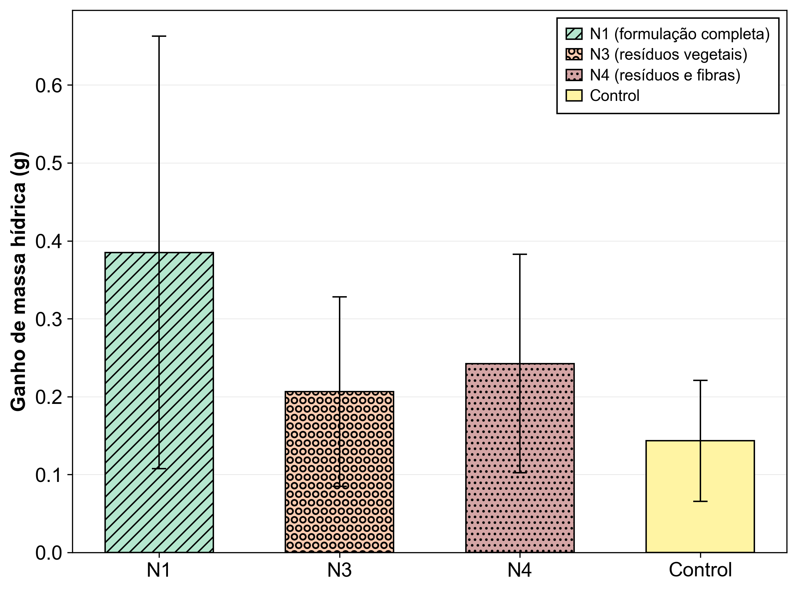{#fig:absorcao width="100%"} 

Nota. As barras de erro representam o intervalo de confiança de 95% por bootstrap BCa da média do ganho de massa hídrica, e letras diferentes indicam diferença estatisticamente detectável entre formulações sob GLM Gamma com ligação log e ajuste de Holm, com $p < 0,05$.

## Compatibilidade Biológica e Cinética de Germinação

A viabilidade técnica do uso de resíduos agroindustriais em matrizes de suporte vegetal depende, primariamente, da ausência de fitotoxicidade aguda [@warman1999_compost_maturity; @zubillaga2006_biosolids_phytotoxicity]. Os dados de germinação (Tabela 2) indicam que o geocomposto não apenas preserva a viabilidade das sementes, mas em formulações específicas, otimiza o microambiente para a emergência [@ceglie2011_compost_peat_substitute]. A formulação completa ($N_1$) atingiu 98% de germinação, estatisticamente superior ao controle (92,6%), o que torna menos provável a ocorrência de liberação de aleloquímicos inibitórios em carga suficiente para suprimir a germinação após o processamento térmico e químico da biomassa de *Typha domingensis* [@hase2012_compost_extract_germination; @zubillaga2006_biosolids_phytotoxicity]. A redução pontual observada em $N_2$ (91%) é compatível com mudanças de composição do compósito, em particular a ausência do solvente limonênico em relação a $N_1$, com potencial para alterar difusão de solutos e o potencial osmótico do extrato no microambiente da semente [@bradford1990_water_relations_germination].

Tabela 2. Análise de variância da germinação de sementes de rúcula conduzidas em extratos de núcleos hidrorretentores e controle.

| Extrato núcleo hidrorretentor | G% (média ± DP) | IVG (média ± DP) | TMG (dias, média ± DP) |
|------------------|------------------|------------------|------------------|
| $N_1$ (formulação completa) | 98.00 ± 1.054 a | 1.421 ± 1.517 a | 2.046 ± 0.022 a |
| $N_2$ (sem resina) | 91.00 ± 1.886 c | 1.183 ± 1.282 a | 1.900 ± 0.039 c |
| $N_3$ (resíduos vegetais) | 95.30 ± 1.059 b | 1.326 ± 1.430 a | 1.990 ± 0.022 b |
| $N_4$ (resíduos e fibras) | 95.90 ± 0.994 b | 1.286 ± 1.356 a | 2.002 ± 0.021 b |
| Control | 92.60 ± 2.459 c | 1.263 ± 1.366 a | 1.933 ± 0.051 c |
| η² parcial | 0.727 | 0.057 | 0.739 |
| Cohen's d (N1 vs Control) | 2.855 | 0.109 | 2.855 |
| p | \<0.001 | 0.997 | \<0.001 |

Complementarmente, a leitura temporal do processo de germinação, quando tratada como tempo até evento, reforça que o efeito das formulações se concentra na germinabilidade final, e não em uma aceleração ou desaceleração reprodutível da cinética. A Figura 6 mostra curvas Kaplan Meier com alta sobreposição ao longo do horizonte de observação, sem abertura persistente de trajetórias que caracterizaria um deslocamento sistemático do risco instantâneo de germinar. 

Essa interpretação é coerente com a inferência do modelo de Cox [@cox1972_regression] com erros robustos por caixa [@lin1989_robust], no qual as razões de risco permaneceram próximas da unidade e com elevada incerteza, com HR de 1.159 em $N_2$, 0.978 em $N_3$, 1.219 em $N_4$ e 1.298 em $N_1$, sempre acompanhadas de intervalos de confiança amplos e não excluindo 1, e com valores de p entre 0.573 e 0.955 na comparação com o controle.

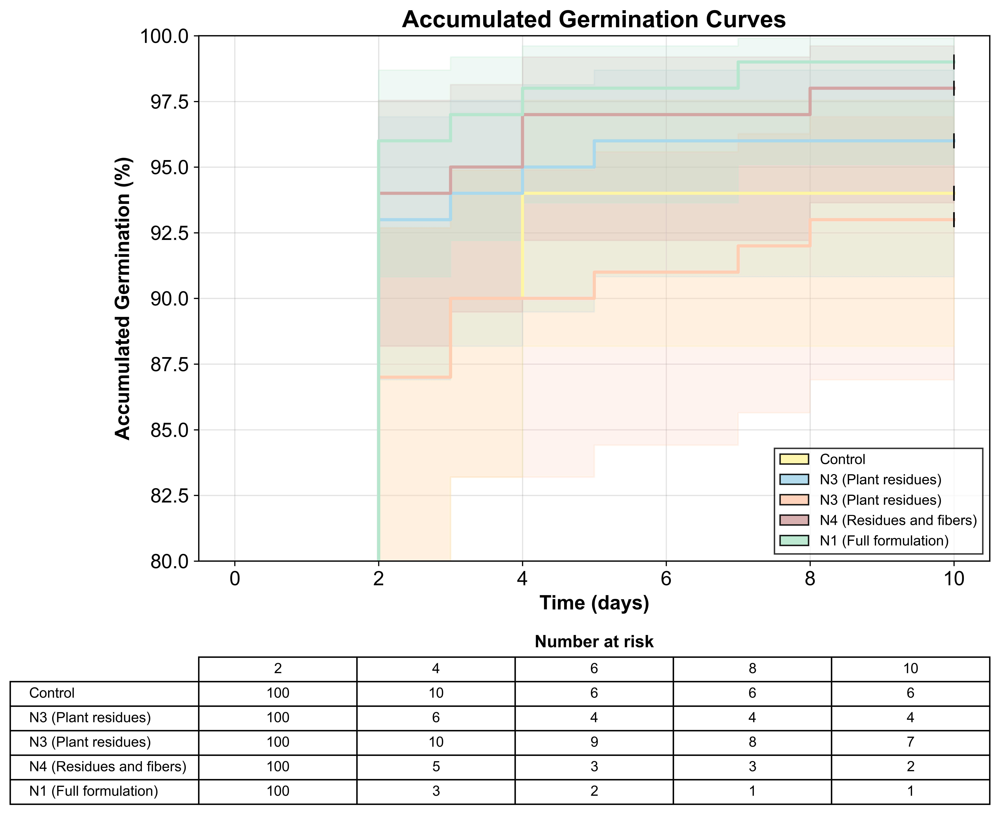{#fig:survival-germinacao width="100%"}

Sob a ótica de engenharia do microambiente, esse padrão sugere que as formulações não impuseram uma alteração consistente no regime de embebição e na disponibilidade efetiva de água em escala de semente, condição que, quando suficientemente intensa, tende a se manifestar como deslocamento temporal detectável na emergência e no vigor inicial por efeito direto sobre a retenção hídrica [@Nada2015_hydrogel] e a liberação gradativa de água em sistemas condicionados por hidrogéis superabsorventes [@Fernandez2022_polyacrylamide]. Assim, a ausência de separação persistente das curvas e na proximidade de HR da unidade na Tabela 3 indicam que a intervenção atuou majoritariamente como ajuste de viabilidade final e não como controlador cinético robusto, ficando as variações pontuais compatíveis com flutuações intrínsecas do sistema e com a estrutura de censura do ensaio.

Tabela 3. Modelo de Cox (referência = controle, água destilada) para tempo até germinação, com HR \> 1 indicando maior velocidade de germinação em relação ao controle. {#tbl:cox-germinacao}

| Tratamento (mapeamento) | HR vs controle | IC95% (HR) | p-value |
| --- | ---: | --- | ---: |
| $N_2$ (sem resina) | 1.159 | 0.495-2.716 | 0.733 |
| $N_3$ (resíduos vegetais) | 0.978 | 0.453-2.109 | 0.955 |
| $N_4$ (resíduos e fibras) | 1.219 | 0.545-2.725 | 0.630 |
| $N_1$ (formulação completa) | 1.298 | 0.524-3.216 | 0.573 |

Do ponto de vista cinético, o ligeiro incremento no Tempo Médio de Germinação (TMG) observado em $N_1$ (2.046 ± 0.022 dias) em relação ao controle (1.933 ± 0.051 dias), correspondendo a aumento de 5,8%, é consistente com o comportamento temporal sintetizado na Figura 6 e reflete modulação física da embebição pela matriz hidrorretentor a, sem configurar toxicidade metabólica. Esse fenômeno alinha-se às observações de @thombare2018_guargum, que descreveram como hidrorretentores alteram a hidrodinâmica da fase I da germinação, prolongando a embebição sem comprometer viabilidade. Concomitantemente, o Índice de Velocidade de Germinação (IVG) em $N_1$ (1.421 ± 1.517) superou o controle (1.263 ± 1.366) em 12,5%, com tamanho de efeito moderado (Cohen's d = 0.109), sinalizando que o retardo na embebição não penalizou a taxa instantânea de germinação quando integrada ao longo do período experimental, conforme sintetizado na Figura 7.

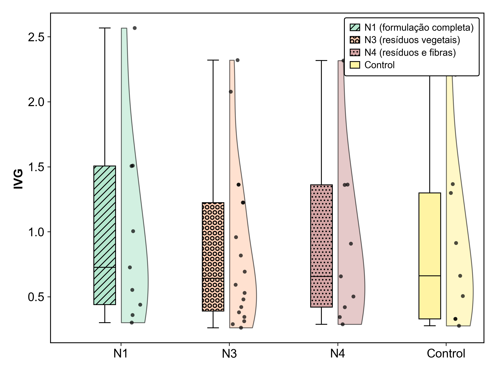{#fig:ivg width="100%"}

Nota. As barras de erro representam o intervalo de confiança de 95% por bootstrap BCa da média, e letras diferentes indicam diferenças estatisticamente significativas sob Tukey HSD, com p \< 0,05.

## Morfogênese e Respostas Bioestimulantes

A análise vetorial da morfogênese (Figura 8) indica que a resposta biológica dos núcleos não se manifesta como supressão sistêmica, mas como estímulo diferencial entre tecidos. No compartimento aéreo (Figura 8a), as formulações $N_1$ e $N_3$ apresentaram incrementos superiores a 100% em relação ao controle, padrão compatível com bioestimulação por frações orgânicas solúveis que modulam a expansão celular em estágio inicial, sem evidência de penalidade global de germinação. Esse comportamento contrasta com perfis de inibição descritos para alelopatia clássica em macrófitas [@cipollini2016_comparison] e permanece coerente com discussões sobre bioestimulantes vegetais [@lucini2018_biostimulant], nas quais o efeito pode emergir como aceleração do alongamento sem requerer alteração mensurável de viabilidade.

Em contrapartida, a arquitetura da resposta radicular (Figura 8b) evidenciou maior dependência da composição do compósito, um padrão recorrente quando a variável resposta é governada por gradientes microssituacionais de potencial hídrico e porosidade funcional [@zou2001_airfilled_porosity], por difusão de oxigênio condicionada pela fração gasosa do meio [@zou2001_airfilled_porosity] e por resistência mecânica do substrato [@bengough1990_mechanical_impedance; @becel2011_penetration_resistance]. Diferentemente do compartimento aéreo, que respondeu de forma marcada à fração vegetal isolada ($N_3$), o crescimento radicular apresentou maiores ganhos nas formulações contendo fibras ou o compósito completo ($N_1$ e $N_4$), sugerindo que a presença de uma fase estruturante atua como condicionante do regime de poros e da conectividade capilar, controlando simultaneamente a oferta de água e a impedância ao avanço da radícula.

Essa dissociação é compatível com relatos de polímeros superabsorventes empregados como condicionadores de substrato, nos quais ganhos em estabelecimento tendem a depender do comportamento de inchamento sob carga e da estabilidade do arcabouço poroso, modulando a dinâmica de água no microambiente sem impor uma assinatura uniforme de fitotoxicidade [@Lejcu2018; @KhodadadiDehkordi2018].

::: {custom-style="Legenda"}
Figura 8. Comprimento médio de (a) hipocótilo e (b) das radículas de rúcula conduzida em extratos de núcleos hidrorretentores de Typha domingensis.
:::

| 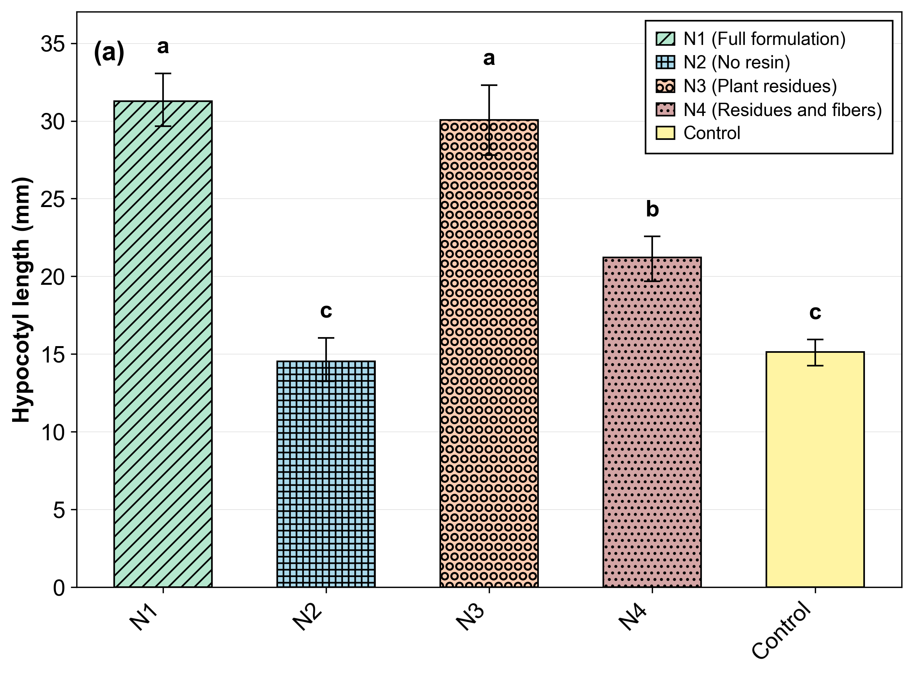{#fig:hipocotilo width="49%"} | 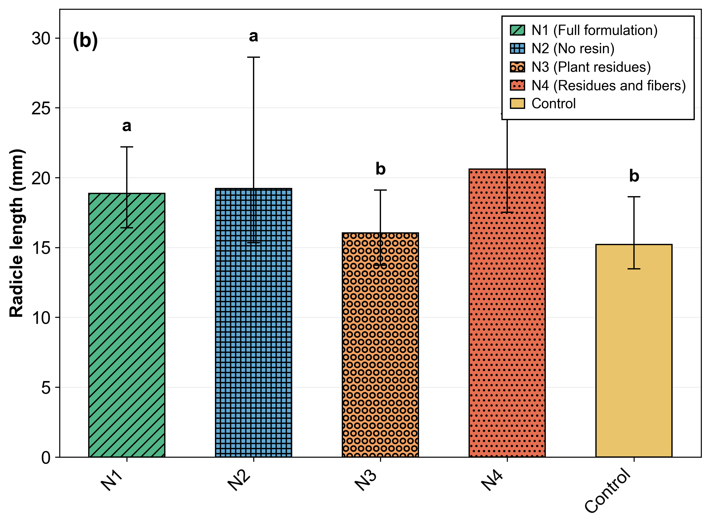{#fig:radicula width="49%"} |
| --- | --- |

Nota. As barras de erro representam o intervalo de confiança de 95% por bootstrap BCa da média, e letras diferentes indicam diferenças estatisticamente detectáveis sob Tukey HSD, com p \< 0,05.

Os resultados quantitativos consolidados no Anexo (Tabela A1) reforçam essa leitura e explicitam a magnitude das diferenças. No hipocótilo, o efeito de tratamento foi forte (p \< 0.001; $\eta^2$ parcial = 0.684), com N1 (31.236 ± 4.490 mm) e N3 (30.075 ± 7.137 mm) formando o patamar superior em relação ao controle (15.121 ± 2.685 mm), isto é, (ΔM = 16.115 mm, Cohen's d = 3.625) e (ΔM = 14.954 mm, Cohen's d = 2.788), respectivamente, enquanto N2 permaneceu próximo ao controle (ΔM = -0.594 mm, Cohen's d = -0.180) e N4 ocupou posição intermediária (ΔM = 6.102 mm, Cohen's d = 1.546). 

Esse padrão é coerente com a hipótese de que o compósito atua como modulador fisiológico, e não como agente de estresse agudo, uma vez que incrementos expressivos em alongamento inicial podem emergir de alterações em turgescência, permeabilidade e balanço osmótico no período pós-embebição, sem requerer mudanças concomitantes em viabilidade ou em marcadores clássicos de dano [@dujardin2015_biostimulants]. Essa assinatura de resposta, com ganho de parte aérea mais pronunciado do que o componente radicular em algumas formulações, é congruente com a noção de que sinais orgânicos em baixa concentração podem atuar como moduladores de resposta, enquanto a cinética de embebição e as transições de turgor permanecem como determinantes de desempenho inicial [@bewley2013_seeds].

No eixo radicular, embora o tamanho de efeito seja menor (p \< 0.001; $\eta^2$ parcial = 0.226), a resposta permaneceu detectável, com N4 (19.498 ± 7.146 mm) e N1 (18.868 ± 7.380 mm) superando o controle (12.857 ± 2.691 mm), com (ΔM = 6.641 mm, Cohen's d = 0.687) e (ΔM = 6.011 mm, Cohen's d = 0.516), respectivamente, ao passo que N3 permaneceu próximo do controle (ΔM = 0.495 mm, Cohen's d = 0.110). Esse comportamento é similar ao observado por @Mo2024, no qual matrizes orgânicas funcionalizadas podem liberar microdoses de carbono lábil e cofatores enzimáticos, mecanismo compatível com incrementos de crescimento sem elevação concomitante de variáveis clássicas de dano.

Quando o efeito é expresso em termos percentuais para a parte aérea, a Figura 9a evidencia diferenças detectáveis entre formulações (p \< 0.001; $\eta^2$ parcial = 0.617), com respostas positivas elevadas em N1 e N4 e valores próximos de zero ou negativos em N2. Esse padrão é consistente com modulação seletiva de vigor, na qual o ganho do hipocótilo se intensifica sem a assinatura típica de supressão generalizada que caracterizaria fitotoxicidade aguda, indicando predominância de rotas de expansão celular e ajuste osmótico sob baixa carga de aleloquímicos, coerente com a resposta hormética [@an2005_hormesis_allelopathy] esperada em modelos dose-resposta aplicados à alelopatia.

Em sistemas receptor-doador, a direção da resposta tende a depender de concentração efetiva e tempo de residência no microambiente, fenômeno discutido em sínteses mecanísticas de alelopatia e interações químicas planta-planta [@schandry2020_allelopathicplants].

Ao analisar o componente radicular sob a mesma ótica, a Figura 9b mostra um sinal mais contido (p \< 0.001; $\eta^2$ parcial = 0.183), com percentuais próximos de zero ou negativos em N2, N3 e no controle, ao passo que N1 e N4 concentram os maiores valores positivos. Em termos de mecanismo, esse desacoplamento entre resposta aérea mais pronunciada e resposta radicular mais moderada é compatível com condicionamento morfofisiológico do sistema, no qual microdoses de compostos orgânicos [@weir2004_allelochemicals_mechanisms] podem alterar a cinética de expansão celular e a alocação de fotoassimilados sem induzir colapso funcional.

A maior sensibilidade do sistema radicular ao gradiente químico e ao balanço redox do microambiente é recorrente em discussões sobre fenolização e interferência metabólica em alelopatia [@gniazdowska2005_multisite; @staszek2021_ros_metabolism], em que pequenas variações de frações fenólicas podem deslocar a resposta do crescimento sem necessariamente configurar dano agudo.

::: {custom-style="Legenda"}
Figura 9. (a) Efeito inibitório no crescimento de hipocótilo e (b) no crescimento da radícula de rúcula conduzida em extratos de núcleos hidrorretentores de Typha domingensis.
:::

| 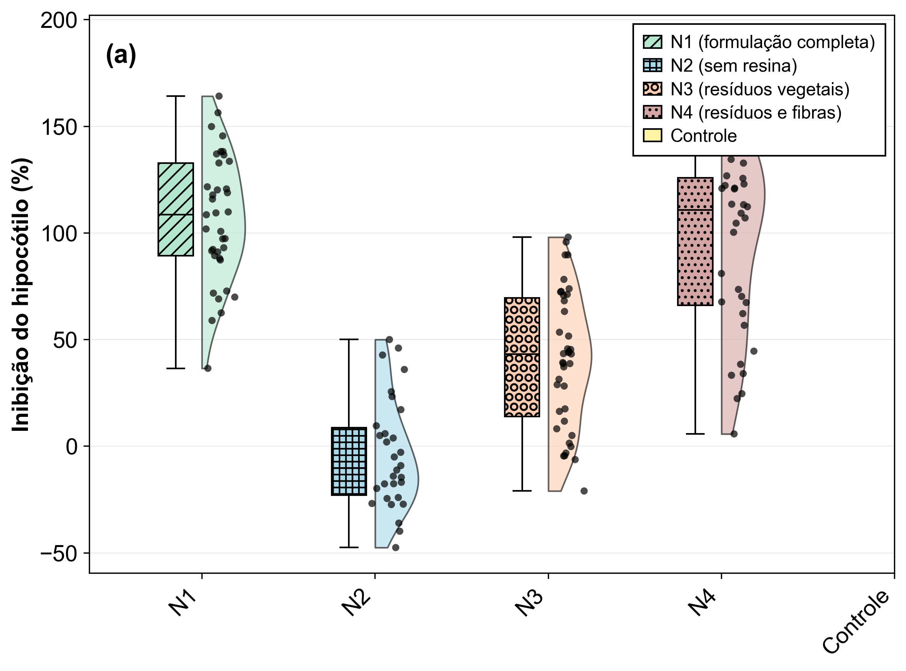{#fig:inibicao-hipo width="49%"} | 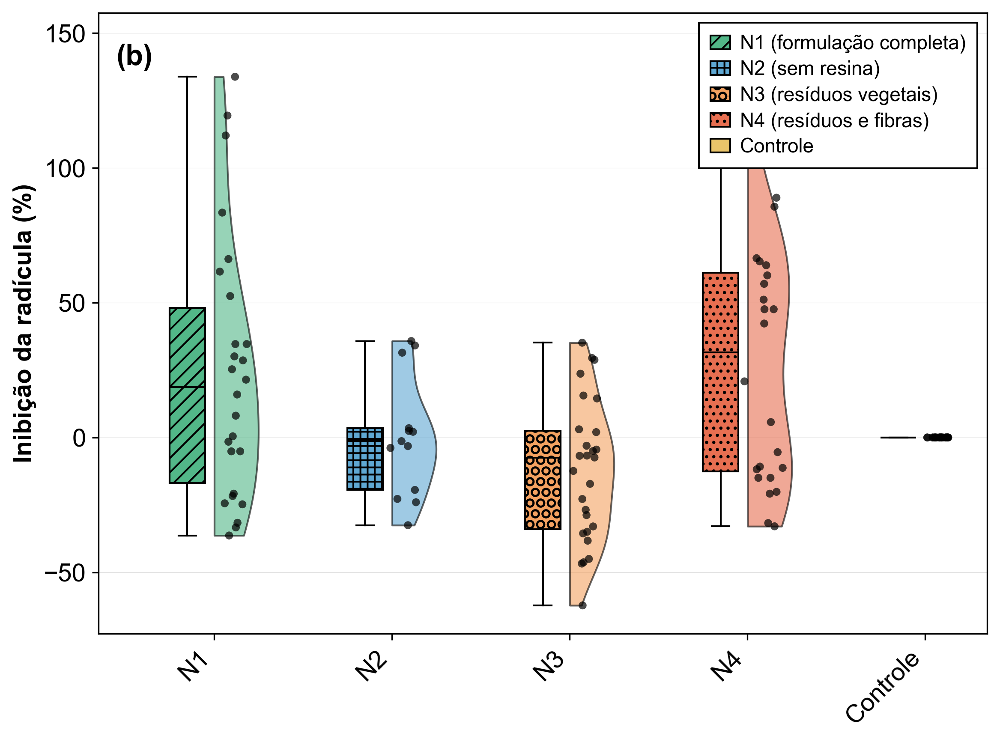{#fig:inibicao-rad width="49%"} |
| --- | --- |

## Performance Agronômica em Mesocosmo

O ensaio em mesocosmo, conduzido em bandeja, foi desenhado para testar se os efeitos observados na triagem inicial se materializam como desempenho agronômico em microcosmo sob ciclos de irrigação e secagem, e essa resposta é sintetizada na Figura 10 por métricas de alongamento relativo e pelo índice de Dependência do Núcleo (DN%). Sob o prisma do alongamento da parte aérea, representado na Figura 10a, não se detectou separação estatisticamente significativa entre os tratamentos (ANOVA; p = 0.7467; $\eta^2$ parcial = 0.019), com médias de 79.516 ± 76.667% ($N_1$), 57.963 ± 56.877% ($N_3$) e 74.812 ± 72.486% ($N_4$).

Mesmo com $N_1$ e $N_4$ exibindo valores médios numericamente superiores a $N_3$, aproximadamente 37% e 29% maiores, respectivamente, a dispersão elevada, expressa por DP altos, reduz a capacidade de discriminação de diferenças em elongação aérea no horizonte avaliado. Esse padrão é consistente com ensaios em microcosmos que avaliam polímeros superabsorventes, nos quais a variabilidade espacial do estabelecimento e a heterogeneidade da umidade podem obscurecer diferenças em endpoints de alongamento [@Palma2024], principalmente quando a resposta é dominada por eventos localizados de falha de pegamento ou por competição intra-bandeja, mesmo na presença de efeitos em retenção hídrica do substrato [@gao2023_quenched].

O comportamento radicular, representado na Figura 10b, foi igualmente dominado pela variabilidade do microcosmo, e não apresentou efeito detectável de tratamento (ANOVA; p = 0.8509; $\eta^2$ parcial = 0.011). As médias de 45.263 ± 58.136% ($N_1$), 59.219 ± 65.854% ($N_3$) e 48.703 ± 55.062% ($N_4$) indicam que a presença do núcleo não impôs penalidade sistemática ao crescimento radicular, sendo a resposta majoritariamente condicionada por heterogeneidade de estabelecimento e competição por recursos. Em sistemas de bandeja, a raiz tende a responder mais à conectividade de poros e à aeração local [@zou2001_airfilled_porosity] e à resistência mecânica do meio [@bengough1990_mechanical_impedance; @becel2011_penetration_resistance] do que a variações moderadas de oferta hídrica, de modo que o condicionador pode atuar como mitigador de estresse intermitente sem se traduzir em alongamento radicular consistente quando o limitante principal é estrutural e não hidrológico.

Em contrapartida, a dependência do crescimento em relação ao núcleo, formalizada por DN% na Figura 10c, apresentou efeito global de tratamento (ANOVA; p = 0.0359; $\eta^2$ parcial = 0.212). O valor médio em $N_1$ (49.817 ± 16.922%) foi aproximadamente 193% superior a $N_3$ (16.986 ± 40.441%) e 179% superior a $N_4$ (17.854 ± 34.286%), o que sugere maior acoplamento entre a formulação completa e a produção de biomassa. Ainda assim, o pós-teste de Tukey HSD não confirmou diferenças par-a-par ao nível de 5%, uma vez que $N_1$ vs $N_4$ apresentou (ΔM = 31.963%, p-aj = 0.0608), $N_1$ vs $N_3$ apresentou (ΔM = 32.831%, p-aj = 0.0691) e $N_3$ vs $N_4$ apresentou (ΔM = -0.868%, p-aj = 0.9979), o que é compatível com um efeito global moderado sob variabilidade elevada e tamanho amostral efetivo reduzido após a filtragem de outliers.

Esse comportamento, com evidência global sem separação robusta em todas as comparações, também é observado em estudos de polímeros superabsorventes quando o ganho depende de heterogeneidade microambiental [@faller2020_poda] e de trajetórias de estabelecimento que variam entre unidades experimentais, produzindo respostas integradoras que se manifestam de forma mais nítida em métricas compostas de acoplamento planta substrato do que em percentuais de alongamento isolados. Do ponto de vista mecanístico, a magnitude das diferenças em DN% permanece coerente com a hipótese de que a formulação completa, combinando fibra e resina, estabiliza o microambiente e sustenta disponibilidade hídrica durante ciclos de irrigação e secagem [@sayeb2010_watersorption].

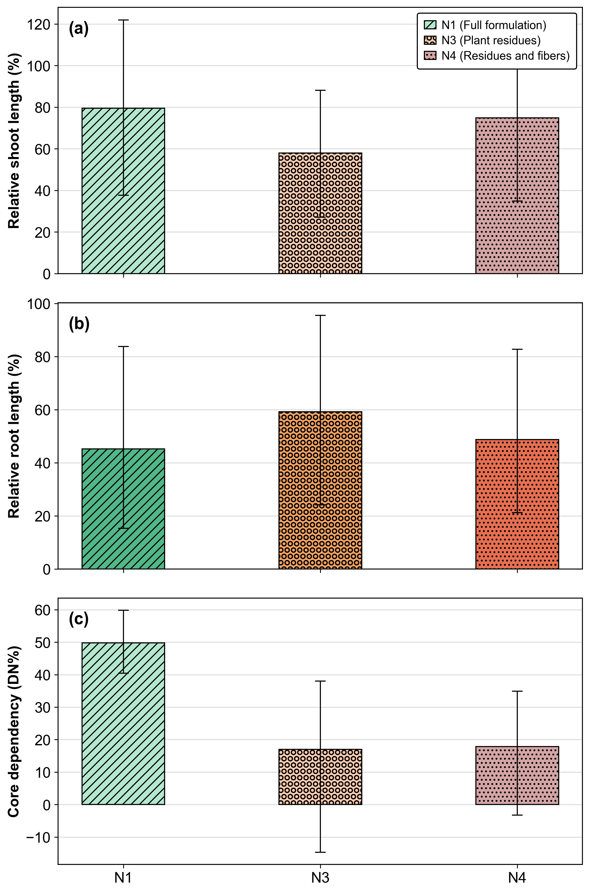{#fig:bandeja-comprimento width="100%"}

Na análise de componentes principais aplicada aos endpoints padronizados, a retenção de dois componentes, com PC1 explicando 53.98% e PC2 explicando 15.50% da variância total, somando 69.48%, concentra a informação estrutural do sistema em um gradiente de desempenho e em um gradiente morfológico (Figura 11), um comportamento convergente com ensaios de condicionadores superabsorventes em substratos nos quais variações na fração de água efetivamente disponível se acoplam a respostas de acúmulo de biomassa sob regime hídrico flutuante.

No biplot, PC1 é governado por variáveis integradoras de acúmulo de massa e dependência do núcleo, com predominância de massa seca total, biomassa da parte aérea e DN%, de modo que deslocamentos para PC1 positivo sinalizam maior eficiência de conversão do microambiente em biomassa quando o condicionador hidráulico mantém continuidade de água capilar durante ciclos de umedecimento e secagem [@Neyshaburi2017_pcaWaterRetention].

A interpretação de PC1 como gradiente de desempenho dominado por variáveis integradoras é coerente com a base conceitual da análise de componentes principais, na qual o primeiro componente tende a capturar a covariação dominante entre métricas de desempenho e condições do sistema, favorecendo a leitura de eficiência relativa entre tratamentos quando as variáveis são padronizadas [@jolliffe2016_pca; @abdi2010_pca]. Concomitantemente, PC2 organiza um contraste de alocação entre compartimentos de alongamento, com sinal oposto entre respostas radiculares e aéreas, caracterizando uma dimensão de reorganização morfofisiológica sob o mesmo regime hídrico, fenômeno compatível com ajustes de partição e plasticidade morfológica sob restrições que migram entre água, aeração e resistência do substrato ao longo do ciclo [@grace1989_effects].

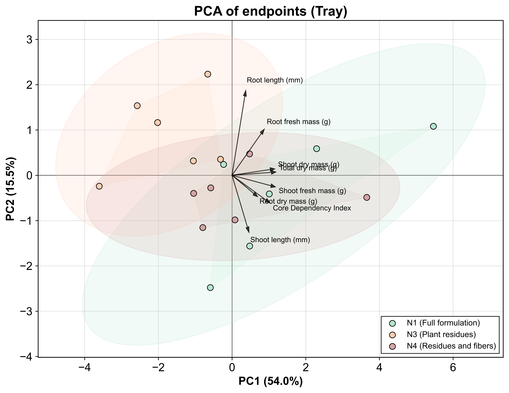{#fig:pca-bandeja width="100%"}

Desse modo, a ocupação de regiões com PC1 mais positivo pela formulação completa $N_1$ é coerente com os incrementos de massa fresca e massa seca observados na Tabela 5 e com os valores médios mais elevados de DN% já quantificados no ensaio em bandeja. Segundo @Shukla2004_pcaBiomass, aplicações de PCA em dados solo--planta tendem a organizar a covariação dominante entre atributos do sistema e produtividade ou biomassa em um eixo principal, favorecendo leituras em que PC1 funciona como um gradiente integrador de desempenho. Nesse enquadramento, o deslocamento de $N_1$ para PC1 positivo indica que a combinação de fibra e resina estabiliza o microambiente sob ciclos de irrigação e secagem, convertendo maior previsibilidade local de água e porosidade funcional em acúmulo de biomassa [@jimenez2021_soilphysical; @larsen2022_watersaturation].

Nessa mesma linha, @Mohammed2015 destaca que, em compósitos reforçados por fibras naturais, a função final depende da integridade da matriz e da interface fibra--matriz, especialmente sob condições em que umidade e variações físico-mecânicas podem reconfigurar a resposta do material ao longo do tempo. Em contraste, a variação ao longo de PC2, com sinal oposto entre comprimentos relativos da parte aérea e da raiz no biplot (Figura 11), tende a representar uma reorganização de alocação sob o mesmo regime hídrico, sem impor necessariamente separação robusta nos percentuais de alongamento, o que permanece compatível com a elevada dispersão observada nessas métricas [@les2020_aquaticmonocots].

O efeito prático em biomassa é apresentado na Tabela 5, corroborando que a resposta do microcosmo se expressa com maior nitidez em métricas integradoras de acúmulo de massa. Para massa fresca, houve efeito de tratamento (p = 0.003; $\eta^2$ parcial = 0.518), com N1 (0.411 ± 0.280 g, letra “a”) superando o controle (0.159 ± 0.080 g, letra “c”) em aproximadamente 159% (Cohen's d = 1.217, efeito grande), enquanto N2, N3 e N4 permaneceram em faixa intermediária (letra “ab”), sem separação robusta em relação a N1 e ao controle. Para massa seca, o efeito também foi detectável (p = 0.017; $\eta^2$ parcial = 0.438), com as formulações N1 a N4 variando entre 0.024 e 0.029 g, acima do controle (0.016 ± 0.004 g, letra “b”), o que corresponde a aumentos aproximados de 50% em N2 e 81% em N4 (Cohen's d = 1.695 para N1 vs Controle, efeito grande). Esse tipo de resposta, mais evidente em acúmulo de massa do que em alongamento percentual, também é esperado quando o fator limitante dominante é a estabilidade do meio e a disponibilidade efetiva de água ao longo do tempo. @kumar2013_biochar discute a lógica de uso de emendas como condicionadores capazes de alterar propriedades do solo, com implicações para crescimento vegetal. Do ponto de vista de material, @dhakal2007_effect demonstra que a absorção de água pode modificar propriedades mecânicas de compósitos reforçados por fibras, reforçando que a durabilidade do arcabouço sob ciclos de umedecimento e secagem é central para manter a funcionalidade do microambiente.

Esse padrão é compatível com melhoria do microambiente físico, principalmente porosidade e aeração sob saturação e retenção hídrica sob secagem [@maslinda2017_effect], cuja persistência depende da integridade do compósito, já que a fração resinosa tende a preservar a arquitetura de poros e a fração fibrosa pode contribuir como suporte físico e fonte de carbono orgânico para processos de estruturação na rizosfera [@kausar2019_interpenetrating].

Tabela 5. Massa fresca e massa seca de plântulas de rúcula cultivadas em extratos de núcleos hidrorretentores e controle. Médias seguidas de letras diferentes indicam diferenças significativas (p \< 0,05; Tukey HSD). {#tbl:massa}

| Extrato núcleo hidrorretentor | Massa fresca (g) | Massa seca (g)  |
|-------------------------------|------------------|-----------------|  
| $N_1$ (formulação completa)      | 0.411 ± 0.280 a  | 0.026 ± 0.006 a |
| $N_2$ (sem resina)               | 0.254 ± 0.129 ab | 0.024 ± 0.005 a |
| $N_3$ (resíduos vegetais)        | 0.208 ± 0.120 ab | 0.025 ± 0.003 a |
| $N_4$ (resíduos e fibras)        | 0.222 ± 0.165 ab | 0.029 ± 0.006 a |
| Control                       | 0.159 ± 0.080 c  | 0.016 ± 0.004 b |
| η² parcial                    | 0.518            | 0.438           |
| Cohen's d (N1 vs Control)     | 1.217            | 1.695           |
| p                             | 0.003            | 0.017           |

Os núcleos hidrorretentores influenciaram principalmente o acúmulo de biomassa, sem evidência de penalidade sistemática de crescimento radicular no microcosmo. Essa assimetria entre métricas integradoras de massa e percentuais de alongamento sugere que o ganho do sistema emerge quando a estabilidade do microambiente se mantém por tempo suficiente para reduzir falhas localizadas de estabelecimento, o que se traduz em acúmulo de biomassa mesmo quando o alongamento permanece dominado por variabilidade espacial [@zhang2021_semiinterpenetrating]. Em conjunto, os resultados sustentam que o desempenho agronômico depende da arquitetura do compósito e da durabilidade da matriz polimérica sob ciclos de umedecimento e secagem, reiterando o papel do aglutinante na estabilidade estrutural do sistema.

# Conclusão

Os resultados indicam que núcleos hidrorretentores orgânicos à base de *Typha domingensis* podem operar como condicionadores hidrofísicos do microambiente de germinação sem evidência de fitotoxicidade aguda no estabelecimento inicial de *Eruca sativa*. A formulação completa, integrando fibras e matriz polimérica, apresentou desempenho convergente entre sorção macroscópica e respostas biológicas de viabilidade e morfometria inicial, sustentando um mecanismo dominado por modulação da embebição e da disponibilidade efetiva de água em escala local, em vez de supressão metabólica por aleloquímicos em carga suficiente para colapsar o vigor. 

No ensaio em microcosmo, o efeito se manifestou de forma mais consistente em métricas integradoras de acúmulo de biomassa e dependência do núcleo do que em percentuais de alongamento, o que é compatível com um sistema governado por heterogeneidade espacial e por ciclos de umedecimento e secagem. 

A aplicabilidade em bioengenharia dos solos depende da manutenção da estabilidade estrutural do compósito ao longo da janela de funcionamento, sendo recomendável ampliar a validação para condições de solo e caracterizar de modo mais resolutivo as frações solúveis e seus gradientes de concentração, mantendo rastreabilidade dos parâmetros analíticos empregados nas rotinas multivariadas para reduzir incerteza mecanística e ampliar reprodutibilidade.

# Disponibilidade de dados {.unnumbered}

O conjunto de dados encontra-se disponível no repositório: <https://doi.org/10.5281/zenodo.18184021>

# Declaração de interesses conflitantes {.unnumbered}

Os autores declaram não haver conflitos de interesse financeiros ou pessoais conhecidos que possam ter influenciado o trabalho relatado neste artigo.

# Declaração de contribuição de autoria (CRediT) {.unnumbered}

Jeangela Carla Rodrigues De Melo: Investigação; Curadoria de dados; Redação - rascunho original.

Brenno Lima Nascimento: Investigação; Curadoria de dados.

Gizelio Menezes Boge: Investigação; Curadoria de dados.

Marcos Vinícius Quirino dos Santos: Investigação; Curadoria de dados.

Marla Ibrahim Uehbe de Oliveira: Validação; Redação - revisão e edição.

Eliana Midori Sussuchi: Conceitualização; Supervisão; Redação - revisão e edição.

Francisco Sandro Rodrigues Holanda: Conceitualização; Supervisão; Redação - revisão e edição.

Luiz Diego Vidal Santos: Análise formal; Visualização; Redação - rascunho original; Redação - revisão e edição.

# Financiamento {.unnumbered}

Esta pesquisa não recebeu financiamento específico de agências de fomento dos setores público, comercial ou sem fins lucrativos.

# Agradecimentos {.unnumbered}

Os autores agradecem à Universidade Federal de Sergipe (UFS) pelo suporte de infraestrutura e ao Instituto Tecnológico e de Pesquisas do Estado de Sergipe (ITPS) pelas análises químicas.

# Referências {.unnumbered}

::: {#refs}
:::