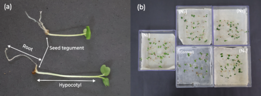

Luiz Diego Vidal Santos (b)*

Francisco Sandro Rodrigues Holanda (a)

Eliana Midori Sussuchi (c)

(a) Agronomy Engineering Department, Federal University of Sergipe (UFS), São Cristóvão, Sergipe, Brazil

(b) Graduate Program in Intellectual Property Science, Federal University of Sergipe (UFS), São Cristóvão, Sergipe, Brazil

(c) Chemical Engineering Department, Federal University of Sergipe (UFS), São Cristóvão, Sergipe, Brazil

* Corresponding author: Luiz Diego Vidal Santos. Email: <vidal.center@academico.ufs.br>. ORCID: https://orcid.org/0000-0001-8659-8557

# Abstract {.unnumbered}

Biodegradable hydroretentive geocomposites coupled to reinforcement geosynthetics can support soil bioengineering if the core increases water availability without releasing phytotoxic compounds. We evaluated four *Typha domingensis* Pers.-based hydroretentive core formulations ($N_1$-$N_4$) as substrates for arugula establishment (*Eruca sativa* Mill.), combining leaf residues and fibers with castor oil-based polyurethane resin, D-limonene, and natural thickeners in different proportions. Core chemistry (pH and macronutrients), fiber FTIR/TGA, macroscopic sorption, and bioassays (germination, GSI, MGT, seedling morphometry, and a tray mesocosm) were assessed with robust inference. The complete formulation ($N_1$) increased germination (98% vs 92.6% control), hypocotyl length (+106.6%), root length (+89.7%), and fresh biomass (+158.5%) without evidence of acute phytotoxicity. $N_1$ also presented near-neutral pH (6.38), high K and P availability, and the highest water mass gain after saturation (2.69x control). Fiber thermal stability up to ~220 degC supports manufacturing without reinforcement degradation. In trays, treatment effects were clearer in biomass and the core-dependency index than in elongation percentages, consistent with microcosm heterogeneity. Overall, the *Typha*-based hydroretentive core acts as a local hydrophysical conditioner that supports early plant establishment, indicating potential for biodegradable geocomposites in revegetation under controlled water supplementation.

## Keywords {.unnumbered}

Geocomposite; hydroretention; bioengineering; phytotoxicity; *Typha domingensis*; *Eruca sativa*

# Introduction

In geoenvironmental engineering, the development of bio-based organic composites responds to a design constraint where functional performance, disposal, and environmental persistence must be treated as coupled variables throughout the life cycle [@prambauer2019_biodegradable]. In revegetation applications, vegetal residues can be converted into support matrices with hydraulic retention and mechanical reinforcement functions, reducing dependence on highly soluble inputs and shifting the control of initial establishment to hydrophysical mechanisms and the plant-substrate interface [@silva2017_reaproveitamento]. In this regime, the lignocellulosic matrix acts as a porous reservoir that stores water and releases it under a water potential gradient, buffering irrigation pulses and reducing the microenvironmental variability that governs germination and emergence [@liu2020_borax].

The performance of hydroretentive geocomposites results from the coupling between filtration, water retention, and mechanical stability, with simultaneous control of flow and structural support when water availability is intermittent [@koerner2012_designing; @cislaghi2020_biodegradable]. Systems with synthetic fractions can achieve performance goals; however, environmental persistence and disposal become part of the engineering problem, justifying substitution with biopolymers and vegetal reinforcements that preserve operational integrity during the critical establishment window and subsequently degrade in a manner compatible with the environment [@daria2020_characteristics; @Giupponi2019HowProposals]. In parallel, the biota associated with the system reconfigures the physical and chemical properties of the microenvironment, such that the final response emerges from the material-microbiota-substrate coupling, with implications for growth uniformity and biological suppression under climatic fluctuation [ @abis2020_reduced; @haiming2020_microbial].

Fibers of *Typha domingensis* Pers. present technological suitability for the problem by offering lignocellulosic fractions with potential for geotextile manufacturing, allowing scalability and process control [@ghosh2009_suitability]. The species is an emergent macrophyte associated with humid and flood-prone environments, where oscillations in oxygenation and saturation are recurrent, and its anatomy with aerenchyma supports internal gas diffusion under hypoxia, a characteristic that indicates functional resilience at soil-water interfaces [@kamali2022_typha; @cunhacruzy2020_rootanatomy]. In the materials domain, the high fraction of cellulose and lignin contributes to stiffness and tensile strength, favoring the maintenance of a stable porous architecture when incorporated into composites, while its tolerance to stress and use in phytoremediation expand applicability in scenarios of high environmental variability [@sujatha2022_cellulose; @deguenon2022_influence; @hegazy2011_phytoremediation].

The use of lignocellulosic biomass in hydroretentive cores, however, requires simultaneous validation of hydrophysical performance and chemical safety, as secondary metabolites can be leached and modulate the germination microenvironment through acetate and shikimate pathways, altering initial growth without necessarily affecting viability [@cheng2015_research; @inderjit1996_phenolics]. Since *Typha domingensis* synthesizes phenolic and terpenic fractions, the formulation must dissociate water retention and matrix stability from the risk of inhibition by allelochemicals, ensuring that hydraulic functionality does not introduce suppression of establishment [ @muzell2016_allelopathy]. Despite recent advances in natural geocomposites for water retention [@akter2020_development; @santos2024_geogrid], a methodological gap remains regarding a unified protocol that connects material properties, sorption, extract chemistry, and biological response in germination and morphogenesis.

This study evaluated four formulations of hydroretentive cores based on *Typha domingensis* Pers. as a substrate for the cultivation of arugula (*Eruca sativa* Mill.), quantifying the chemical integrity and thermal stability of the reinforcement, chemical characterization of the formulations, macroscopic sorption, and biological response via germination, germination kinetics, and initial morphometry, as well as performance in a tray mesocosm. The objective was to test whether the complete formulation operates as a hydrophysical conditioner of the microenvironment without evidence of acute phytotoxicity, using statistical inference capable of separating morphogenic gains from experimental variability.

# Material and methods

## Location and experimental conditions

The experiment was conducted in a greenhouse at the Department of Agronomic Engineering of the Federal University of Sergipe (UFS), in the state of Sergipe, Brazil. The approximate geographic coordinates of the site are 10°55'29.2" S, 37°06'55.9" W, located at an average altitude of 50 meters above sea level. The region is classified as Aw type according to the Köppen-Geiger classification system [@alvares2013_koppen; @koppen1936_klimate].

## Characteristics of arugula seeds

The arugula seeds (*Eruca sativa* Mill.) used were of the Folha Larga cultivar, as registered in the National Cultivar Registry of MAPA No. 0448 [@mapa2012_rnc_rucula]. They presented physical purity of 98%, standard germination of 85%, maximum moisture of 10%, and typical germinative behavior with emergence between 3 to 5 days under optimal conditions [@vieira2011_qualidade].

This cultivar is reported to be responsive to management conditions and water availability in the initial stage, justifying its use as an indicator species in bioactivity screenings [@dijkstra2017_cultivo].

## Manufacture of hydroretentive geocomposites

Leaves of cattail (*Typha domingensis*) were harvested while maintaining the rhizome in the soil. The leaf blade and sheath were separated, cut in a guillotine, and the fibers washed in running water and air-dried for 72 h, with the operational flow synthesized in Fig. 1. The leaf blade was ground in a hammer mill to generate fine plant residue. In lignocellulosic materials, dimensional parameters and mechanical resistance exhibit relevant variability as a function of species, anatomical fraction, and processing, which affects wettability, sorption, and structural integrity in composites [@cesar2015_cellulose; @betene2020_physicochemical].

The fibers and residues received chemical treatment with castor oil-based vegetable resin, D-limonene solvent, and natural thickeners (Amide 90% and *Aloe vera* extract), considering that hydrocolloid agents and plant extracts can alter the water retention regime and solute availability in the plant propagule microenvironment in screening assays [@luligo2024_aloevera; @priolo2024_duckweed].

The bicomponent resin was formulated in a 2:1 ratio (prepolymer, isocyanate, and polyol), allowing for a controlled polyaddition reaction in a renewable-based polyurethane matrix [@cardoso2013_resinasmamona; @botvinova2020_bicomponent]. After homogenization in a gluing machine for five minutes until uniform distribution of liquid fractions, the material was pressed at 1 ton for 24 h in a metallic mold (Fig. 1). The absorbent cores have a thickness of 50 mm with a density of 0.625 g/cm³, and the complete hydroretentive geocomposite is 100 mm thick with a density of 1.432 g/cm³.

{#fig:fibras width="100%"}

Four formulations were produced. Formulation $N_1$ (complete formulation) was composed of 24% leaf blade, 20% fibers, 20% resin, 6% solvent, and 30% thickener. Formulation $N_2$ (without resin) was composed of 44% leaf blade, 20% distilled water, 6% solvent, and 30% thickener, without resin. Formulation $N_3$ (plant residues) was composed of 44% leaf blade, 20% resin, 6% solvent, and 30% thickener. Formulation $N_4$ (residues and fibers) was composed of 24% leaf blade, 20% fibers, 26% resin, and 30% thickener, without solvent. Homogenization was performed in a gluing machine for five minutes until uniform liquid fraction distribution.

## Fiber Characterization

Chemical and morphological characterization of *Typha domingensis* fibers was performed to verify structural integrity and chemical functionality of the fibrous substrate after mechanical processing using Fourier Transform Infrared Spectroscopy (FTIR). Analyses were conducted on a PerkinElmer Spectrum Two spectrometer, operating in the spectral range of 4000 to 400 cm⁻¹ with a resolution of 4 cm⁻¹ and 32 scans per sample, using pressed KBr pellets containing 2 mg of ground fiber dried at 60 °C.

The thermal stability of the fibrous reinforcement, a determining parameter for the resin curing process, was evaluated by thermogravimetry (TGA) using a Shimadzu TGA-50 analyzer. Samples (approximately 5 mg) were heated from 25 to 600 °C at a rate of 10 °C min⁻¹, under an inert nitrogen atmosphere (flow of 100 mL min⁻¹).

## Chemical Characterization of Formulations

The nutritional and chemical profile of the hydroretentive cores ($N_1$-$N_4$) was determined to validate the potential for macronutrient supply and the reaction of the medium (pH). Analyses were conducted by the Technological and Research Institute of the State of Sergipe (ITPS), adopting official protocols from the Ministry of Agriculture, Livestock and Supply (MAPA) for tests on fertilizers and correctives, in accordance with Normative Instruction SDA No. 3 of 2015 [@brasil_mapa_sda_in03_2015_metodos_oficiais].

Total Nitrogen, Phosphorus (soluble in NAC + water and Total), Potassium (K⁺), Calcium (Ca²⁺), and Magnesium (Mg²⁺) contents were quantified, in addition to pH in aqueous suspension. This characterization aims to dissociate the physical effect of water retention from the potential chemical effect of base fertilization conferred by the decomposition of the organic matrix.

## Phytotoxicity evaluation

### Extract preparation and setup

Extracts ($N_1$-$N_4$) and the control (distilled water) were prepared in a 1:10 ratio (20 g to 180 mL distilled water). The material was subjected to mechanical agitation for 5 minutes in an orbital shaker, followed by 15 minutes of rest at room temperature and filtration through qualitative filter paper to remove solid particles. The pH of each extract was determined according to the Embrapa method [@embrapa2009_ph] using a calibrated digital potentiometer.

Arugula seeds underwent a rigorous asepsis process to eliminate fungal contamination, with immersion in 70% ethyl alcohol for 1 minute, followed by immersion in 0.2% sodium hypochlorite solution for 1 minute, and three successive washes in autoclaved distilled water for 1 minute each, using flamed tweezers for transfer between solutions. After asepsis, seeds were arranged in Gerbox boxes (transparent acrylic 11 × 11 × 3.5 cm) containing previously autoclaved qualitative filter paper, moistened with the prepared extracts in a proportion of 2.5 times the dry weight of the substrate. Each treatment used 100 seeds distributed in five Gerbox boxes (20 seeds per box). The boxes were kept in a BOD incubator (growth chamber) at a controlled temperature of 20 °C, under a photoperiod of 8/16 h (light/dark) for a total period of 10 days.

### Effect of extracts on germination

Germination kinetics were parameterized by the Germination Speed Index (GSI), calculated by the summation of the ratio between daily germination and time (Eq. 1), according to Maguire's methodology [@maguire1962_speed]:

$$ GSI = \sum_{i=1}^{n} \frac{G_i}{N_i} \label{eq:ivg} $$

Simultaneously, the uniformity of the process was measured by the Mean Germination Time (MGT), defined by the weighted average of germination events (Eq. 2), according to Labouriau [@labouriau1983_germinacao]:

$$ MGT = \frac{\sum G_i T_i}{\sum G_i} \label{eq:tmg} $$

The magnitude of phytotoxic or biostimulant interference was determined by the percentage variation of biological parameters relative to the control (Eq. 3), where $X_T$ and $X_C$ represent the mean values of the response variables in the treatment and control, respectively:

$$ \text{Inhibition (\%)} = \frac{X_T - X_C}{X_C} \times 100 \label{eq:inibicao} $$

To paralyze metabolism and preserve tissue architecture for digital morphometric analysis, seedlings were subjected to freezing (-10 °C; 24 h) immediately after the 10-day experimental period, and subsequently measured (root and shoot) via image processing in ImageJ software.

{#fig:morfologia width="100%"}

### Evaluation of growth and production conducted in soil

#### First bioassay (trays)

The mesocosm experimental configuration adopted a Completely Randomized Design (CRD), totaling 20 replications per treatment ($N_1$-$N_4$ and control). The edaphic support matrix was reconstituted through an equiproportional ternary mixture (1:1:1 v/v) of Quartzarenic Neosol (Entisol), commercial organic substrate, and humus, with a standardized mass of 50 g per experimental unit inoculated with the core. The culture establishment protocol involved sowing in duplicate with population adjustment thinning to one remaining individual on the 8th day after emergence (DAE), maintaining a daily irrigation regime and nutritional supplementation via the core every 15 days (start: 15th DAE). The growth phase extended for 44 days, after which a subgroup (n=5) was directed to the subsequent bioassay.

Plant growth modeling was based on dimensionless relative performance indices. The elongation efficiency of root tissues (Eq. 4) and shoot tissues (Eq. 5) was determined by the normalized ratio between the biometric means of treatments ($R_T, A_T$) and the control ($R_C, A_C$):

$$ R \% = \frac{R_T}{R_C} \times 100 \label{eq:r} $$

$$ CPA \% = \frac{A_T}{A_C} \times 100 \label{eq:cp} $$

The global vigor of the batch ($IVP\%$) integrated germinative capacity ($G\%$) and total seedling growth ($CTP$) into a single physiological robustness indicator (Eq. 6). Structurally, the compactness of the root system was measured by Root Density ($DensRad$), expressing biomass allocation per unit of occupied volume (Eq. 7):

$$ IVP \% = \frac{G \% \times CTP}{100} \label{eq:ivp} $$

$$ \text{DensRad} = \frac{\text{root mass (g)}}{\text{root volume (cm}^3)} \label{eq:densrad} $$

Finally, the relative contribution of the bio-input to biomass accumulation was quantified by the Core Dependency Index ($DN\%$), comparing dry matter production in the conditioned system ($MS_{CS}$) versus the non-supplemented system ($MS_{SS}$) (Eq. 8):

$$ DN \% = \frac{MS_{CS} - MS_{SS}}{MS_{CS}} \times 100 \label{eq:dn} $$

#### Statistical Analysis

The analytical architecture was founded on the Completely Randomized Design (CRD), preceded by rigorous validation of residual normality assumptions (Shapiro-Wilk) and homoscedasticity of variances (Levene). Aiming to mitigate the instability inherent to finite biological datasets and guarantee the robustness of estimators outside ideal asymptotic normality, the bootstrapping resampling technique was implemented with 1,000 iterations. This procedure generated 95% Bias-Corrected and Accelerated (BCa) Confidence Intervals, providing a safer inference about the population mean.

*Post-hoc* mean segregation used the Tukey HSD test (p \< 0.05) as error control in multiple comparisons, allowing the interpretation of differences between treatment pairs without inflating the false positive rate in matrices with multiple responses [@hsu1996_multiplecomparisons]. In parallel, outliers were diagnosed per treatment group using the 1.5 times interquartile range criterion, removing only observations that distorted empirical dispersion without representing the central process regime, a procedure applied to morphometric and kinetic responses prior to mean estimation and model fitting. Beyond statistical significance, the magnitude of the biological phenomenon was dimensioned by effect size metrics (Cohen's *d* and partial $\eta^2$), permitting the interpretation of the practical relevance of interventions.

Sorption metrics ($\Delta m$ and $\Delta m_{rel}$) were evaluated using Generalized Linear Models with Gamma distribution and log link function, a strategy suitable for strictly positive and asymmetric responses. Absolute water mass gain was operationalized as paired difference per disc, with $\Delta m = m_{\text{wet}} - m_{\text{dry}}$, preserving the intrinsic structure of the assay and reducing dependence associated with wet-dry pairing. Negative values attributed to gravitational drainage and weighing variability were tracked, suppressed from inferential adjustment, and kept in record for process traceability. Inference was implemented in Python 3.13 using the Statsmodels library, and differences between formulations were evaluated by Wald tests in multiple comparisons with Holm adjustment, with visual segregation by letters incorporated directly into figures where pertinent.

To explicitly integrate the temporal dimension of germination, data were analyzed as time-to-event, using Kaplan-Meier curves (accumulated germination) and the Cox proportional hazards model. Original records were structured as cumulative counts by time in Gerbox boxes (20 seeds per replication); to allow modeling, counts were expanded to observations at the seed level, preserving the total per box and considering censoring on the 10th day for non-germinated seeds. The Cox adjustment used robust standard errors with clustering by box (replication), and coefficients were interpreted as hazard ratios (HR) relative to the control (distilled water).

Additionally, to synthesize the multivariate mesocosm response (lengths, masses, and dependence index), Principal Component Analysis (PCA) was applied after standardization (*z-score*), allowing visualization of co-variation patterns and multivariate separation between formulations.

# Results and Discussion

## Technological Characterization of Fibrous Reinforcement

The chemical integrity of *Typha domingensis* fibers after mechanical comminution was corroborated by the infrared spectroscopic profile (FTIR), presented in Fig. 3. The spectrum exhibits a broad and intense band centered at 3340 cm⁻¹, attributed to the stretching of O-H bonds of hydroxyl groups present in cellulose, hemicellulose, and lignin. The prominence of this band is relevant for the proposed application, as it confirms high availability of surface hydrophilic sites, a fundamental mechanism for water retention and hydrogen bond formation at the fiber-matrix interface.

Peaks observed at 2918 and 2850 cm⁻¹ correspond, respectively, to asymmetric and symmetric stretching of C-H bonds in aliphatic chains (methyl and methylene groups), structural constituents of polysaccharides. The presence of a well-defined peak at 1735 cm⁻¹, characteristic of carbonyl stretching (C=O) of acetyl groups (hemicellulose components) and esters of ferulic or p-coumaric acid (lignin), indicates that processing did not induce severe oxidative degradation or substantial removal of these amorphous fractions. Additionally, vibrations of the lignin aromatic skeleton were identified at 1605 and 1510 cm⁻¹, along with the band at 1240 cm⁻¹ (C-O stretching of the aryl ring), confirming the lignocellulosic nature of the reinforcement and its intrinsic chemical stability.

{#fig:ftir width="100%"}

The thermal behavior of the reinforcement, a determinant for the composite processing window, is detailed in the thermogravimetric curve (TGA) in Fig. 4. The initial mass loss event (\~6%) occurs below 100 °C, attributed to the elimination of physically adsorbed water and low molecular weight volatiles, reiterating the hygroscopic character of the material mapped in FTIR.

Structural thermal degradation effectively initiates around 220 °C (*Tonset*), with a characteristic "shoulder" extending up to 300 °C, associated with the thermal depolymerization of hemicelluloses, which possess lower stability due to their amorphous and branched structure. The main degradation event occurs in the range of 310 to 380 °C, where the curve presents its maximum inclination (maximum derivative), corresponding to the rupture of glycosidic chains of crystalline cellulose (α-cellulose). Thermal stability up to \~220 °C validates the use of these fibers in the vegetable polyurethane resin curing process, which occurs at significantly lower temperatures, ensuring that the reinforcement acts without premature thermal degradation. The solid residue at 600 °C (greater than 20%) reflects inorganic content (silica or phytoliths) and the carbonaceous structure of condensed lignin, which contributes to the chemical inertia of the final product.

{#fig:tga width="100%"}

## Chemical Characterization of Hydroretentive Cores

Analysis of elemental composition and pH of the cores (Table 1) demonstrated that the incorporation of the castor oil-based polymeric matrix ($N_1$) significantly altered the chemical profile of the substrate. Composite $N_1$ presented a pH near neutrality (6.38), while formulations without the complete resin ($N_2$, $N_3$) exhibited acidic character (pH < 4.5), typical of unbuffered lignocellulosic residues.

In nutritional terms, $N_1$ stood out for its high concentration of Potassium (1004.98 mg L⁻¹) and Total Phosphorus (62.01 mg L⁻¹), values higher than those observed in purely fibrous fractions ($N_4$ with K = 740.74 mg L⁻¹ and P = 9.85 mg L⁻¹). As the base matrix of the system is the lignocellulosic core of cattail fibers, the castor oil-based resin should be interpreted only as a formulation component of $N_1$, and the coupling between fiber and resin phase can modify solute release in the extract. Total Nitrogen was reported as below the method's quantification limit (LOQ = 0.16%) in all samples, characterizing censored data rather than a quantified concentration.

In natural populations of *Typha domingensis*, foliar N concentrations on the order of 30.54±2.01 to 33.04±2.15 mg g⁻¹ dry mass (approximately 3.05 to 3.30% dry basis) are reported, reinforcing that the result obtained here describes the N fraction accessible to the analytical protocol applied to the processed matrix and not the typical nutritional signature of intact leaf tissue [@esteves2013_resorption]. Under these conditions, the biological response observed in seedlings cannot be attributed to direct nitrogen fertilization, remaining more consistent with the improvement of physical properties of the microenvironment and biostimulant effects associated with soluble organic fractions released by the matrix. Calcium and Magnesium levels in N1 (577.5 and 292.6 mg L⁻¹, respectively) also suggest a cationic balance favorable to root development.

This chemical configuration of $N_1$ (neutral pH and high P and K availability) converges with the ecophysiological requirements of *Eruca sativa*, which presents optimal development at pH 6.0-7.0, where macronutrient availability is maximized and Al³⁺ phytotoxicity is neutralized [@filgueira2008_novo].

The acidity observed in $N_2$ and $N_3$ (pH ~4.4) is critical, as in soil matrices, values below 5.0 can induce restrictions of P, Ca, and Mg, in addition to potentiating the solubility of toxic metals [@taiz2017_physiology]. In the context of bioengineering, the neutralization provided by composite $N_1$ indicates that the formulation acts as a local acidity corrective, creating micro-hotspots favorable for root colonization in degraded or acidic soils.

Additionally, the reporting of Total Nitrogen below the LOQ decouples the observed biostimulant effect (hypocotyl gain) from a classical "dose-dependent" trophic response. Vegetative vigor in $N_1$ appears to be sustained by the balance of K⁺ in osmoregulation, essential for maintaining cellular turgor under water fluctuations, and by the supply of P for germination energy metabolism. The detection of high levels of Potassium aligns with the capacity of *Typha* to bioaccumulate nutrients, suggesting that the core functions as a fertility reservoir that recycles elements extracted from the biomass utilized in manufacturing.

Table 1. Chemical and nutritional characterization of hydroretentive cores (N1-N4), indicating pH and macronutrient concentration. {#tbl:quimica}

| Parameter | Unit | $N_1$ (complete formulation) | $N_2$ (no resin) | $N_3$ (plant residues) | $N_4$ (residues and fibers) |
|:-----------|:----------:|:----------:|:----------:|:----------:|:----------:|
| Total Nitrogen | \% | \<0.16 | \<0.16 | \<0.16 | \<0.16 |
| Phosphorus (NAC + water) | mg L⁻¹ | 61.27 | 15.61 | 18.43 | 9.74 |
| Potassium (K⁺) | mg L⁻¹ | 1004.98 | 849.65 | 897.00 | 740.74 |
| pH (H₂O) | \- | 6.38 | 4.43 | 4.36 | 5.57 |
| Total Phosphorus | mg L⁻¹ | 62.01 | 15.82 | 18.72 | 9.85 |
| Calcium (Ca²⁺) | mg L⁻¹ | 577.50 | 406.10 | 522.40 | 330.70 |
| Magnesium (Mg²⁺) | mg L⁻¹ | 292.60 | 225.30 | 243.30 | 200.30 |

## Macroscopic Sorption of the Hydroretentive Core

Moisture kinetics demonstrated that formulation $N_1$ (complete formulation) accumulated 0.385 ± 0.278 g of water per disc (Fig. 5), with a 95% confidence interval obtained by BCa bootstrap between 0.223 and 0.641 g, outperforming other compositions and multiplying by 2.7 the gain observed in the water control, which reached 0.143 ± 0.078 g and remained between 0.078 and 0.195 g in the 95% BCa CI. Formulations $N_3$ (plant residues) and $N_4$ (residues and fibers) recorded 0.207 ± 0.060 g and 0.193 ± 0.164 g, with 95% BCa CI from 0.164 to 0.261 g in $N_3$ and from 0.063 to 0.322 g in $N_4$, preserving an absolute gain superior to the control, but with lower magnitude and partial overlap of inferential ranges between treatments. When absolute water mass gain was treated by Generalized Linear Model with Gamma distribution and log link, the planned contrast between $N_1$ and the control indicated a mean ratio of 2.69 and statistical evidence after Holm adjustment for multiple comparisons (adjusted p = 0.014), while contrasts $N_3$ and $N_4$ versus control remained without evidence of difference (adjusted p ≥ 0.313). The amplified standard deviation in $N_1$ is consistent with water hysteresis and microstructural heterogeneity, compatible with matrices having anisotropic microchannels and preferential imbibition pathways.

Relative mass variation ($\Delta m_{rel}$) exceeded 1400% in formulation $N_1$ (complete formulation), while the control remained at 856%, indicating greater water storage capacity under test conditions and suggesting slower water release after irrigation pulses. The Core Dependency Index calculated in this laboratory assay maintained means of 42.28 ± 20.83% for $N_4$ (residues and fibers) and 34.28 ± 20.79% for $N_1$, evidencing that more hygroscopic cores tend to sustain more prolonged water support to seedlings under drying cycles.

{#fig:absorcao width="100%"} 

Note. Error bars represent 95% BCa bootstrap confidence interval of the mean water mass gain, and different letters indicate statistically detectable difference between formulations under Gamma GLM with log link and Holm adjustment, with $p < 0.05$.

## Biological Compatibility and Germination Kinetics

Technical viability of using agro-industrial residues in plant support matrices depends primarily on the absence of acute phytotoxicity [@warman1999_compost_maturity; @zubillaga2006_biosolids_phytotoxicity]. Germination data (Table 2) indicate that the geocomposite not only preserves seed viability but, in specific formulations, optimizes the microenvironment for emergence [@ceglie2011_compost_peat_substitute]. The complete formulation ($N_1$) reached 98% germination, statistically superior to the control (92.6%), making the occurrence of inhibitory allelochemical release in sufficient load to suppress germination unlikely following thermal and chemical processing of *Typha domingensis* biomass [@hase2012_compost_extract_germination; @zubillaga2006_biosolids_phytotoxicity]. The isolated reduction observed in $N_2$ (91%) is compatible with composite composition changes, particularly the absence of limonenic solvent relative to $N_1$, with potential to alter solute diffusion and extract osmotic potential in the seed microenvironment [@bradford1990_water_relations_germination].

Table 2. Analysis of variance of arugula seed germination conducted in hydroretentive core extracts and control.

| Hydroretentive core extract | G% (mean ± SD) | GSI (mean ± SD) | MGT (days, mean ± SD) |
|------------------|------------------|------------------|------------------|
| $N_1$ (complete formulation) | 98.00 ± 1.054 a | 1.421 ± 1.517 a | 2.046 ± 0.022 a |
| $N_2$ (no resin) | 91.00 ± 1.886 c | 1.183 ± 1.282 a | 1.900 ± 0.039 c |
| $N_3$ (plant residues) | 95.30 ± 1.059 b | 1.326 ± 1.430 a | 1.990 ± 0.022 b |
| $N_4$ (residues and fibers) | 95.90 ± 0.994 b | 1.286 ± 1.356 a | 2.002 ± 0.021 b |
| Control | 92.60 ± 2.459 c | 1.263 ± 1.366 a | 1.933 ± 0.051 c |
| partial η² | 0.727 | 0.057 | 0.739 |
| Cohen's d (N1 vs Control) | 2.855 | 0.109 | 2.855 |
| p | \<0.001 | 0.997 | \<0.001 |

Complementarily, the temporal reading of the germination process, when treated as time-to-event, reinforces that the effect of formulations concentrates on final germinability, rather than on a reproducible acceleration or deceleration of kinetics. Fig. 6 shows Kaplan-Meier curves with high overlap throughout the observation horizon, without persistent trajectory divergence that would characterize a systematic shift in the instantaneous hazard of germination.

This interpretation is consistent with the inference of the Cox model [@cox1972_regression] with robust errors per box [@lin1989_robust], where hazard ratios remained close to unity and with high uncertainty, with HR of 1.159 in $N_2$, 0.978 in $N_3$, 1.219 in $N_4$, and 1.298 in $N_1$, always accompanied by wide confidence intervals overlapping 1, and with p-values between 0.573 and 0.955 in comparison with the control.

{#fig:survival-germinacao width="100%"}

From a microenvironment engineering perspective, this pattern suggests that formulations did not impose a consistent alteration on the imbibition regime and effective water availability at the seed scale, a condition that, when sufficiently intense, tends to manifest as a detectable temporal shift in emergence and initial vigor due to direct effects on water retention [@Nada2015_hydrogel] and gradual water release in systems conditioned by superabsorbent hydrogels [@Fernandez2022_polyacrylamide]. Thus, the absence of persistent curve separation and HR proximity to unity in Table 3 indicate that the intervention acted mostly as a final viability adjustment rather than a robust kinetic controller, with point variations remaining compatible with intrinsic system fluctuations and the assay censoring structure.

Table 3. Cox model (reference = control, distilled water) for time-to-germination, with HR \> 1 indicating greater germination speed relative to control. {#tbl:cox-germinacao}

| Treatment (mapping) | HR vs control | 95% CI (HR) | p-value |
| --- | ---: | --- | ---: |
| $N_2$ (no resin) | 1.159 | 0.495-2.716 | 0.733 |
| $N_3$ (plant residues) | 0.978 | 0.453-2.109 | 0.955 |
| $N_4$ (residues and fibers) | 1.219 | 0.545-2.725 | 0.630 |
| $N_1$ (complete formulation) | 1.298 | 0.524-3.216 | 0.573 |

From a kinetic standpoint, the slight increment in Mean Germination Time (MGT) observed in $N_1$ (2.046 ± 0.022 days) relative to control (1.933 ± 0.051 days), corresponding to a 5.8% increase, is consistent with the temporal behavior synthesized in Fig. 6 and reflects physical modulation of imbibition by the hydroretentive matrix, without configuring metabolic toxicity. This phenomenon aligns with observations by @thombare2018_guargum, who described how hydroretainers alter the hydrodynamics of germination phase I, prolonging imbibition without compromising viability. Concomitantly, the Germination Speed Index (GSI) in $N_1$ (1.421 ± 1.517) exceeded the control (1.263 ± 1.366) by 12.5%, with moderate effect size (Cohen's d = 0.109), signaling that imbibition delay did not penalize the instantaneous germination rate when integrated over the experimental period, as synthesized in Fig. 7.

{#fig:ivg width="100%"}

Note. Error bars represent 95% BCa bootstrap confidence interval of the mean, and different letters indicate statistically detectable differences under Tukey HSD, with p \< 0.05.

## Morphogenesis and Biostimulant Responses

Vectorial analysis of morphogenesis (Fig. 8) indicates that the biological response of cores does not manifest as systemic suppression, but as differential stimulation between tissues. In the aerial compartment (Fig. 8a), formulations $N_1$ and $N_3$ presented increments exceeding 100% relative to control, a pattern compatible with biostimulation by soluble organic fractions that modulate cell expansion at an early stage, without evidence of global germination penalty. This behavior contrasts with inhibition profiles described for classical allelopathy in macrophytes [@cipollini2016_comparison] and remains coherent with discussions on plant biostimulants [@lucini2018_biostimulant], where the effect can emerge as elongation acceleration without requiring measurable viability alteration.

In contrast, root response architecture (Fig. 8b) evidenced greater dependence on composite composition, a recurring pattern when the response variable is governed by microsituational gradients of water potential and functional porosity [@zou2001_airfilled_porosity], by oxygen diffusion conditioned by the gaseous fraction of the medium [@zou2001_airfilled_porosity], and by mechanical resistance of the substrate [@bengough1990_mechanical_impedance; @becel2011_penetration_resistance]. Unlike the aerial compartment, which responded markedly to the isolated fraction ($N_3$), root growth showed greater gains in formulations containing fibers or the complete composite ($N_1$ and $N_4$), suggesting that the presence of a structuring phase acts as a conditioner of the pore regime and capillary connectivity, simultaneously controlling water supply and impedance to radicle advance.

This dissociation is compatible with reports of superabsorbent polymers employed as substrate conditioners, where establishment gains tend to depend on swelling behavior under load and porous framework stability, modulating water dynamics in the microenvironment without imposing a uniform phytotoxicity signature [@Lejcu2018; @KhodadadiDehkordi2018].

::: {custom-style="Legenda"}
Figure 8. Mean length of (a) hypocotyl and (b) radicles of arugula conducted in extracts of Typha domingensis hydroretentive cores.

| {#fig:hipocotilo width="49%"} | {#fig:radicula width="49%"} |
| --- | --- |

:::

Note. Error bars represent 95% BCa bootstrap confidence interval of the mean, and different letters indicate statistically detectable differences under Tukey HSD, with p \< 0.05.

Quantitative results consolidated in the Annex (Table A1) reinforce this reading and make the magnitude of differences explicit. In the hypocotyl, treatment effect was strong (p \< 0.001; partial $\eta^2$ = 0.684), with N1 (31.236 ± 4.490 mm) and N3 (30.075 ± 7.137 mm) forming the upper tier relative to control (15.121 ± 2.685 mm), i.e., (ΔM = 16.115 mm, Cohen's d = 3.625) and (ΔM = 14.954 mm, Cohen's d = 2.788), respectively, while N2 remained close to control (ΔM = -0.594 mm, Cohen's d = -0.180) and N4 occupied an intermediate position (ΔM = 6.102 mm, Cohen's d = 1.546).

This pattern is coherent with the hypothesis that the composite acts as a physiological modulator, and not as an acute stress agent, since expressive increments in initial elongation can emerge from alterations in turgidity, permeability, and osmotic balance in the post-imbibition period, without requiring concomitant changes in viability or classical damage markers [@dujardin2015_biostimulants]. This response signature, with aerial part gain more pronounced than the root component in some formulations, is congruent with the notion that organic signals in low concentration can act as response modulators, while imbibition kinetics and turgor transitions remain as initial performance determinants [@bewley2013_seeds].

In the root axis, although effect size is smaller (p \< 0.001; partial $\eta^2$ = 0.226), the response remained detectable, with N4 (19.498 ± 7.146 mm) and N1 (18.868 ± 7.380 mm) outperforming control (12.857 ± 2.691 mm), with (ΔM = 6.641 mm, Cohen's d = 0.687) and (ΔM = 6.011 mm, Cohen's d = 0.516), respectively, whereas N3 remained close to control (ΔM = 0.495 mm, Cohen's d = 0.110). This behavior is similar to that observed by @Mo2024, where functionalized organic matrices can release microdoses of labile carbon and enzymatic cofactors, a mechanism compatible with growth increments without concomitant elevation of classical damage variables.

When effect is expressed in percentage terms for the aerial part, Fig. 9a evidences detectable differences between formulations (p \< 0.001; partial $\eta^2$ = 0.617), with high positive responses in N1 and N4 and values close to zero or negative in N2. This pattern is consistent with selective vigor modulation, in which hypocotyl gain intensifies without the typical generalized suppression signature characterizing acute phytotoxicity, indicating predominance of cell expansion pathways and osmotic adjustment under low allelochemical load, coherent with hormetic response [@an2005_hormesis_allelopathy] expected in dose-response models applied to allelopathy.

In receptor-donor systems, response direction tends to depend on effective concentration and residence time in the microenvironment, a phenomenon discussed in mechanistic syntheses of allelopathy and plant-plant chemical interactions [@schandry2020_allelopathicplants].

Analyzing the root component under the same optic, Fig. 9b shows a more contained signal (p \< 0.001; partial $\eta^2$ = 0.183), with percentages close to zero or negative in N2, N3, and control, whereas N1 and N4 concentrate the highest positive values. In terms of mechanism, this decoupling between more pronounced aerial response and more moderate root response is compatible with morphophysiological conditioning of the system, where microdoses of organic compounds [@weir2004_allelochemicals_mechanisms] can alter cell expansion kinetics and photoassimilate allocation without inducing functional collapse.

Greater sensitivity of the root system to the chemical gradient and redox balance of the microenvironment is recurrent in discussions on phenolization and metabolic interference in allelopathy [@gniazdowska2005_multisite; @staszek2021_ros_metabolism], where small variations of phenolic fractions can shift growth response without necessarily configuring acute damage.

::: {custom-style="Legenda"}
Figure 9. (a) Inhibitory effect on hypocotyl growth and (b) on radicle growth of arugula conducted in extracts of Typha domingensis hydroretentive cores.

| {#fig:inibicao-hipo width="49%"} | {#fig:inibicao-rad width="49%"} |
| --- | --- |

:::

## Agronomic Performance in Mesocosm

The mesocosm assay, conducted in trays, was designed to test whether effects observed in initial screening materialize as agronomic performance in microcosm under irrigation and drying cycles, and this response is synthesized in Fig. 10 by relative elongation metrics and Core Dependency Index (DN%). Under the prism of aerial part elongation, represented in Fig. 10a, no statistically significant separation was detected between treatments (ANOVA; p = 0.7467; partial $\eta^2$ = 0.019), with means of 79.516 ± 76.667% ($N_1$), 57.963 ± 56.877% ($N_3$), and 74.812 ± 72.486% ($N_4$).

Even with $N_1$ and $N_4$ exhibiting mean values numerically superior to $N_3$, approximately 37% and 29% higher, respectively, elevated dispersion, expressed by high SD, reduces discrimination capacity of differences in aerial elongation over the evaluated horizon. This pattern is consistent with microcosm assays evaluating superabsorbent polymers, where spatial establishment variability and moisture heterogeneity can obscure differences in elongation endpoints [@Palma2024], especially when response is dominated by localized establishment failure events or intra-tray competition, even in the presence of substrate water retention effects [@gao2023_quenched].

Root behavior, represented in Fig. 10b, was equally dominated by microcosm variability, and presented no detectable treatment effect (ANOVA; p = 0.8509; partial $\eta^2$ = 0.011). Means of 45.263 ± 58.136% ($N_1$), 59.219 ± 65.854% ($N_3$), and 48.703 ± 55.062% ($N_4$) indicate that core presence did not impose systematic penalty on root growth, with response being consistently conditioned by establishment heterogeneity and resource competition. In tray systems, roots tend to respond more to pore connectivity and local aeration [@zou2001_airfilled_porosity] and medium mechanical resistance [@bengough1990_mechanical_impedance; @becel2011_penetration_resistance] than to moderate water supply variations, such that the conditioner can act as an intermittent stress mitigator without translating into consistent root elongation when the main constraint is structural rather than hydrological.

In contrast, growth dependency relative to the core, formalized by DN% in Fig. 10c, presented a global treatment effect (ANOVA; p = 0.0359; partial $\eta^2$ = 0.212). The mean value in $N_1$ (49.817 ± 16.922%) was approximately 193% higher than $N_3$ (16.986 ± 40.441%) and 179% higher than $N_4$ (17.854 ± 34.286%), suggesting greater coupling between the complete formulation and biomass production. Still, Tukey HSD post-test did not confirm pairwise differences at 5% level, since $N_1$ vs $N_4$ presented (ΔM = 31.963%, p-adj = 0.0608), $N_1$ vs $N_3$ presented (ΔM = 32.831%, p-adj = 0.0691), and $N_3$ vs $N_4$ presented (ΔM = -0.868%, p-adj = 0.9979), which is compatible with a moderate global effect under elevated variability and reduced effective sample size after outlier filtering.

This behavior, with global evidence without robust separation in all comparisons, is also observed in superabsorbent polymer studies when gain depends on microenvironmental heterogeneity [@faller2020_poda] and establishment trajectories varying between experimental units, producing integrating responses that manifest more clearly in compound metrics of plant-substrate coupling than in isolated elongation percentages. From a mechanistic perspective, magnitude of differences in DN% remains coherent with the hypothesis that the complete formulation, combining fiber and resin, stabilizes the microenvironment and sustains water availability during irrigation and drying cycles [@sayeb2010_watersorption].

{#fig:bandeja-comprimento width="100%"}

In PCA applied to standardized endpoints, retention of two components, with PC1 explaining 53.98% and PC2 explaining 15.50% of total variance, summing 69.48%, concentrates system structural information into a performance gradient and a morphological gradient (Fig. 11), a behavior convergent with trials of superabsorbent conditioners in substrates where variations in effectively available water fraction couple with biomass accumulation responses under fluctuating water regime.

In the biplot, PC1 is governed by integrating mass accumulation and core dependency variables, with predominance of total dry mass, shoot biomass, and DN%, such that shifts to positive PC1 signal greater microenvironment conversion efficiency into biomass when the hydraulic conditioner maintains capillary water continuity during wetting and drying cycles [@Neyshaburi2017_pcaWaterRetention].

Interpretation of PC1 as a performance gradient dominated by integrating variables is coherent with the conceptual basis of principal component analysis, where the first component tends to capture dominant covariation between performance metrics and system conditions, favoring relative efficiency reading between treatments when variables are standardized [@jolliffe2016_pca; @abdi2010_pca]. Concomitantly, PC2 organizes an allocation contrast between elongation compartments, with opposite sign between root and aerial responses, characterizing a morphophysiological reorganization dimension under the same water regime, phenomenon compatible with partition adjustments and morphological plasticity under constraints migrating between water, aeration, and substrate resistance throughout the cycle [@grace1989_effects].

{#fig:pca-bandeja width="100%"}

Thus, occupation of regions with more positive PC1 by complete formulation $N_1$ is coherent with fresh mass and dry mass increments observed in Table 5 and with nigher mean DN% values already quantified in the tray assay. According to @Shukla2004_pcaBiomass, PCA applications in soil-plant data tend to organize dominant covariation between system attributes and productivity or biomass on a principal axis, favoring readings where PC1 functions as an integrating performance gradient. In this framework, displacement of $N_1$ to positive PC1 indicates that fiber and resin combination stabilizes the microenvironment under irrigation and drying cycles, converting greater local water predictability and functional porosity into biomass accumulation [@jimenez2021_soilphysical; @larsen2022_watersaturation].

Along this line, @Mohammed2015 highlights that, in natural fiber-reinforced composites, final function depends on matrix integrity and fiber-matrix interface, especially under conditions where moisture and physical-mechanical variations can reconfigure material response over time. In contrast, variation along PC2, with opposite sign between relative shoot and root lengths in biplot (Fig. 11), tends to represent allocation reorganization under the same water regime, without necessarily imposing robust separation in elongation percentages, which remains compatible with elevated dispersion observed in these metrics [@les2020_aquaticmonocots].

Practical biomass effect is presented in Table 5, corroborating that microcosm response expresses with greater clarity in integrating mass metrics. For fresh mass, treatment effect was present (p = 0.003; partial $\eta^2$ = 0.518), with N1 (0.411 ± 0.280 g, letter “a”) outperforming control (0.159 ± 0.080 g, letter “c”) by approximately 159% (Cohen's d = 1.217, large effect), while N2, N3, and N4 remained in intermediate range (letter “ab”), without robust separation relative to N1 and control. For dry mass, effect was also detectable (p = 0.017; partial $\eta^2$ = 0.438), with formulations N1 to N4 varying between 0.024 and 0.029 g, above control (0.016 ± 0.004 g, letter “b”), corresponding to approximate increases of 50% in N2 and 81% in N4 (Cohen's d = 1.695 for N1 vs Control, large effect). This type of response, more evident in mass accumulation than in percentage elongation, is also expected when the dominant limiting factor is medium stability and effective water availability over time. @kumar2013_biochar discusses the logic of using amendments as conditioners capable of altering soil properties, with implications for plant growth. From a material standpoint, @dhakal2007_effect demonstrates that water absorption can modify mechanical properties of fiber-reinforced composites, reinforcing that framework durability under wetting and drying cycles is central to maintaining microenvironment functionality.

This pattern is compatible with physical microenvironment improvement, mainly porosity and aeration under saturation and water retention under drying [@maslinda2017_effect], whose persistence depends on composite integrity, since the resinous fraction tends to preserve pore architecture and the fibrous fraction can contribute as physical support and organic carbon source for rhizosphere structuring processes [@kausar2019_interpenetrating].

Table 5. Fresh mass and dry mass of arugula seedlings cultivated in hydroretentive core extracts and control. Means followed by different letters indicate significant differences (p \< 0.05; Tukey HSD). {#tbl:massa}

| Hydroretentive core extract | Fresh mass (g) | Dry mass (g)  |
|-------------------------------|------------------|-----------------|  
| $N_1$ (complete formulation)      | 0.411 ± 0.280 a  | 0.026 ± 0.006 a |
| $N_2$ (no resin)               | 0.254 ± 0.129 ab | 0.024 ± 0.005 a |
| $N_3$ (plant residues)        | 0.208 ± 0.120 ab | 0.025 ± 0.003 a |
| $N_4$ (residues and fibers)        | 0.222 ± 0.165 ab | 0.029 ± 0.006 a |
| Control                       | 0.159 ± 0.080 c  | 0.016 ± 0.004 b |
| partial η²                    | 0.518            | 0.438           |
| Cohen's d (N1 vs Control)     | 1.217            | 1.695           |
| p                             | 0.003            | 0.017           |

Hydroretentive cores influenced mainly biomass accumulation, without evidence of systematic root growth penalty in microcosm. This asymmetry between integrating mass metrics and elongation percentages suggests that system gain emerges when microenvironment stability is maintained long enough to reduce localized establishment failures, translating into biomass accumulation even when elongation remains dominated by spatial variability [@zhang2021_semiinterpenetrating]. Together, results sustain that agronomic performance depends on composite architecture and polymeric matrix durability under wetting and drying cycles, reiterating the binder's role in system structural stability.

# Conclusion

Results indicate that organic hydroretentive cores based on *Typha domingensis* can operate as hydrophysical conditioners of the germination microenvironment without evidence of acute phytotoxicity in the initial establishment of *Eruca sativa*. The complete formulation, integrating fibers and polymeric matrix, presented convergent performance between macroscopic sorption and biological responses of viability and initial morphometry, sustaining a mechanism dominated by modulation of imbibition and effective local water availability, rather than metabolic suppression by allelochemicals in sufficient load to collapse vigor.

In the mesocosm assay, the effect manifested more consistently in integrating metrics of biomass accumulation and core dependency than in elongation percentages, which is compatible with a system governed by spatial heterogeneity and wetting and drying cycles.

Applicability in soil bioengineering depends on maintaining composite structural stability throughout the functional window, recommending expanded validation for soil conditions and more resolute characterization of soluble fractions and their concentration gradients, maintaining traceability of analytical parameters employed in multivariate routines to reduce mechanistic uncertainty and expand reproducibility.

# Data availability {.unnumbered}

The dataset is available in the repository: https://doi.org/10.5281/zenodo.18184021

# Declaration of competing interests {.unnumbered}

The authors declare that they have no known competing financial interests or personal relationships that could have appeared to influence the work reported in this paper.

# CRediT authorship contribution statement {.unnumbered}

Jeangela Carla Rodrigues De Melo: Investigation; Data curation; Writing - original draft.

Brenno Lima Nascimento: Investigation; Data curation.

Gizelio Menezes Boge: Investigation; Data curation.

Marcos Vinícius Quirino dos Santos: Investigation; Data curation.

Marla Ibrahim Uehbe de Oliveira: Validation; Writing - review & editing.

Eliana Midori Sussuchi: Conceptualization; Supervision; Writing - review & editing.

Francisco Sandro Rodrigues Holanda: Conceptualization; Supervision; Writing - review & editing.

Luiz Diego Vidal Santos: Formal analysis; Visualization; Writing - original draft; Writing - review & editing.

# Funding {.unnumbered}

This research did not receive any specific grant from funding agencies in the public, commercial, or not-for-profit sectors.

# Acknowledgements {.unnumbered}

The authors thank the Federal University of Sergipe (UFS) for infrastructure support and the Technological and Research Institute of the State of Sergipe (ITPS) for the chemical analyses.

# References {.unnumbered}

::: {#refs}
:::

